# OpenDataGov — Arquitetura

## Visão Geral (Fase 4 — Enterprise & AI Experts)

```mermaid
graph TB
    %% ─── Clients ────────────────────────────────────────────
    subgraph Clients
        UI[DataHub Frontend + Extensions<br/>:9002]
        GrafanaUI[Grafana<br/>:3000]
        AdminUI[Keycloak Admin<br/>:8443]
        SDK[Python SDK<br/>odg-sdk]
        CLI[CLI Tool<br/>odg]
    end

    %% ─── API Gateway ────────────────────────────────────────
    subgraph Gateway["API Gateway (Go)"]
        GW[gateway<br/>:8080<br/>REST + GraphQL proxy]
    end

    %% ─── Auth ───────────────────────────────────────────────
    subgraph Auth["Autenticação & Autorização"]
        KC["Keycloak<br/>:8443<br/>OIDC / SAML"]
        OPA["OPA<br/>:8181<br/>Policy-as-Code (Rego)"]
    end

    %% ─── Application Services ───────────────────────────────
    subgraph Services["Serviços Aplicacionais (Python/FastAPI + gRPC)"]
        GOV[governance-engine<br/>:8000 REST / :50051 gRPC<br/>Decisões, RACI, Veto, Audit]
        LH[lakehouse-agent<br/>:8001 REST / :50052 gRPC<br/>Promoção Medallion, MinIO]
        DE[data-expert<br/>:8002 REST<br/>AI Expert, Active Metadata]
        QG[quality-gate<br/>:8003 REST / :50053 gRPC<br/>Great Expectations, DQ Scores]
        DRIFT[drift-monitor<br/>:8004 REST<br/>Evidently, Retraining Triggers]
        MESH_API[data-mesh-api<br/>:8005 REST<br/>Data Products, Contracts]
    end

    %% ─── AI Expert Orchestration ──────────────────────────────
    subgraph AIExperts["AI Experts (Multi-Expert System)"]
        ORCH[expert-orchestrator<br/>:8010<br/>Routing, Context, Workflow]
        CODE_EXP[code-expert<br/>:8011<br/>Code Analysis]
        NLP_EXP[nlp-expert<br/>:8012<br/>NLP Tasks]
        VISION_EXP[vision-expert<br/>:8013<br/>Image Analysis]
        RAG_EXP[rag-expert<br/>:8014<br/>RAG Retrieval]
    end

    %% ─── FinOps ───────────────────────────────────────────────
    subgraph FinOps["FinOps Dashboard"]
        FINOPS[finops-dashboard<br/>:8020<br/>Cost Tracking, Anomaly Detection,<br/>Budget Alerts]
    end

    %% ─── Enterprise Support ───────────────────────────────────
    subgraph Support["Enterprise Support Portal"]
        PORTAL[support-portal<br/>:8030<br/>Tickets, SLA, Knowledge Base]
    end

    %% ─── GPU Management ──────────────────────────────────────
    subgraph GPUMgmt["GPU Cluster Management"]
        GPU_MGR[gpu-manager<br/>:8040<br/>Job Queue, K8s Orchestrator]
    end

    %% ─── Federation ──────────────────────────────────────────
    subgraph Federation["Cosmos Federation"]
        FED_SVC[federation-service<br/>:50060 gRPC<br/>Cross-Instance Queries,<br/>Sharing Agreements]
    end

    %% ─── Shared Library ─────────────────────────────────────
    subgraph Core["Biblioteca Compartilhada"]
        ODG[odg-core<br/>Models, Enums, Audit,<br/>Telemetry, Auth, Contracts,<br/>Privacy, Compliance]
    end

    %% ─── Data Catalog & Lineage ─────────────────────────────
    subgraph Catalog["Catálogo & Lineage"]
        DH_GMS[DataHub GMS<br/>:8083<br/>Metadata Store]
        DH_FE[DataHub Frontend<br/>:9002]
        ES[Elasticsearch<br/>:9200<br/>Search Index]
    end

    %% ─── Message Brokers ────────────────────────────────────
    subgraph Messaging["Mensageria"]
        NATS[NATS JetStream<br/>:4222<br/>Governance Events]
        KAFKA[Apache Kafka 3.9 KRaft<br/>:9092<br/>No Zookeeper]
    end

    %% ─── Streaming ────────────────────────────────────────────
    subgraph Streaming["Real-Time Processing"]
        FLINK[Apache Flink<br/>Real-Time DQ + Features]
    end

    %% ─── MLOps ────────────────────────────────────────────────
    subgraph MLOps["MLOps Platform"]
        KFP_SVC[Kubeflow Pipelines<br/>ML Workflows]
        KSERVE[KServe<br/>Model Serving]
        FEAST_SVC[Feast<br/>Feature Store]
    end

    %% ─── Data Storage ───────────────────────────────────────
    subgraph Storage["Armazenamento"]
        PG[PostgreSQL 16<br/>:5432<br/>State, Audit, SLAs]
        REDIS[Redis 7<br/>:6379<br/>Cache, Sessions]
        MINIO[MinIO<br/>:9000<br/>Object Storage / S3<br/>Bronze→Silver→Gold→Platinum]
    end

    %% ─── Secrets ────────────────────────────────────────────
    subgraph Secrets["Gestão de Segredos"]
        VAULT[HashiCorp Vault<br/>:8200<br/>Secrets, Transit, PKI]
    end

    %% ─── Observability ──────────────────────────────────────
    subgraph Observability["Observabilidade + FinOps"]
        OTEL[OTel Collector<br/>:4317 / :4318<br/>Traces, Metrics, Logs]
        JAEGER[Jaeger<br/>:16686<br/>Distributed Tracing]
        VM[VictoriaMetrics<br/>:8428<br/>Metrics TSDB]
        LOKI[Loki<br/>:3100<br/>Log Aggregation]
        GRAFANA[Grafana<br/>:3000<br/>Dashboards Unificados]
        OPENCOST[OpenCost<br/>Cost Allocation]
    end

    %% ─── GitOps & Scaling ───────────────────────────────────
    subgraph Platform["Plataforma K8s"]
        ARGO[ArgoCD<br/>GitOps Deploy]
        KEDA[KEDA<br/>Event-driven Autoscaling]
    end

    %% ─── Connections: Clients ───────────────────────────────
    UI --> DH_FE
    GrafanaUI --> GRAFANA
    AdminUI --> KC
    SDK -->|REST + GraphQL| GW
    CLI -->|REST + GraphQL| GW

    %% ─── Connections: Gateway → Services ────────────────────
    GW -->|REST + GraphQL| GOV
    GW -->|REST + GraphQL| LH
    GW -->|REST| DE
    GW -->|REST + GraphQL| QG
    GW -->|REST| DRIFT
    GW -->|REST| MESH_API
    GW -->|REST| ORCH
    GW -->|REST| FINOPS
    GW -->|REST| PORTAL
    GW -->|REST| GPU_MGR

    %% ─── Connections: Auth flow ─────────────────────────────
    GW -.->|JWT validate| KC
    GOV -.->|authz check| OPA
    LH -.->|authz check| OPA
    DE -.->|authz check| OPA
    QG -.->|authz check| OPA
    OPA -.->|JWKS| KC

    %% ─── Connections: Inter-service ─────────────────────────
    LH -->|validate before promote gRPC| QG
    LH -->|request governance decision gRPC| GOV
    DE -->|suggest metadata| GOV
    GOV -->|register expert| DE
    DRIFT -->|trigger retraining| KFP_SVC
    DRIFT -->|model metrics| KSERVE
    ORCH -->|route tasks| CODE_EXP
    ORCH -->|route tasks| NLP_EXP
    ORCH -->|route tasks| VISION_EXP
    ORCH -->|route tasks| RAG_EXP
    FED_SVC -->|cross-instance lineage| GOV

    %% ─── Connections: Shared Library ────────────────────────
    GOV -.->|imports| ODG
    LH -.->|imports| ODG
    DE -.->|imports| ODG
    QG -.->|imports| ODG

    %% ─── Connections: Messaging ─────────────────────────────
    GOV -->|governance events| NATS
    GOV -->|audit events| KAFKA
    LH -->|OpenLineage events| KAFKA
    KAFKA -->|lineage ingest| DH_GMS
    FLINK -->|consume| KAFKA
    FLINK -->|real-time DQ| QG

    %% ─── Connections: MLOps ─────────────────────────────────
    KFP_SVC -->|model training| KSERVE
    KFP_SVC -->|features| FEAST_SVC
    FEAST_SVC -->|store| REDIS
    KSERVE -->|serve models| GW

    %% ─── Connections: Storage ───────────────────────────────
    GOV --> PG
    LH --> PG
    LH --> MINIO
    QG --> PG
    DE --> PG
    GOV --> REDIS
    DH_GMS --> PG
    DH_GMS --> ES
    DH_GMS --> KAFKA
    FINOPS --> PG
    PORTAL --> PG
    GPU_MGR --> PG

    %% ─── Connections: Secrets ───────────────────────────────
    MINIO -.->|SSE-KMS| VAULT
    KC -.->|secrets| VAULT
    GOV -.->|secrets| VAULT

    %% ─── Connections: Telemetry ─────────────────────────────
    GOV -->|OTLP| OTEL
    LH -->|OTLP| OTEL
    DE -->|OTLP| OTEL
    QG -->|OTLP| OTEL
    GW -->|OTLP| OTEL
    OTEL -->|traces| JAEGER
    OTEL -->|metrics| VM
    OTEL -->|logs| LOKI
    GRAFANA -->|query| JAEGER
    GRAFANA -->|query| VM
    GRAFANA -->|query| LOKI
    OPENCOST -->|cost metrics| VM
    GRAFANA -->|query| OPENCOST

    %% ─── Connections: GitOps & Scaling ──────────────────────
    ARGO -.->|sync| GOV
    ARGO -.->|sync| LH
    ARGO -.->|sync| DE
    ARGO -.->|sync| QG
    ARGO -.->|sync| GW
    KEDA -.->|scale trigger| KAFKA
    KEDA -.->|scale| GOV
    KEDA -.->|scale| LH

    %% ─── Styling ────────────────────────────────────────────
    classDef service fill:#4A90D9,stroke:#2C5F8A,color:#fff
    classDef infra fill:#6B7280,stroke:#4B5563,color:#fff
    classDef storage fill:#10B981,stroke:#059669,color:#fff
    classDef observability fill:#F59E0B,stroke:#D97706,color:#fff
    classDef auth fill:#EF4444,stroke:#DC2626,color:#fff
    classDef catalog fill:#8B5CF6,stroke:#7C3AED,color:#fff
    classDef platform fill:#EC4899,stroke:#DB2777,color:#fff
    classDef aiexpert fill:#06B6D4,stroke:#0891B2,color:#fff
    classDef finops fill:#F97316,stroke:#EA580C,color:#fff
    classDef federation fill:#A855F7,stroke:#9333EA,color:#fff

    class GOV,LH,DE,QG,GW,DRIFT,MESH_API service
    class PG,REDIS,MINIO storage
    class OTEL,JAEGER,VM,LOKI,GRAFANA observability
    class KC,OPA,VAULT auth
    class DH_GMS,DH_FE,ES catalog
    class NATS,KAFKA,FLINK infra
    class ARGO,KEDA platform
    class ODG service
    class ORCH,CODE_EXP,NLP_EXP,VISION_EXP,RAG_EXP aiexpert
    class FINOPS,OPENCOST finops
    class FED_SVC federation
    class PORTAL,GPU_MGR service
    class KFP_SVC,KSERVE,FEAST_SVC platform
```



## APIs Disponíveis (Fase 4)

OpenDataGov oferece múltiplos protocolos de API para diferentes casos de uso:

### REST API (FastAPI)

- **Base**: `/api/v1/`
- **OpenAPI Docs**: Disponível em `/docs` em cada serviço
- **Core Services**:
  - **governance-engine** (`:8000`) - Decisões de governança, RACI, aprovações, audit trail
  - **lakehouse-agent** (`:8001`) - Promoção de dados, gestão de camadas Medallion
  - **data-expert** (`:8002`) - Recomendações de AI, metadata ativa
  - **quality-gate** (`:8003`) - Validações de qualidade, DQ scores
  - **drift-monitor** (`:8004`) - Model drift detection, retraining triggers
  - **data-mesh-api** (`:8005`) - Data products, contracts, domains
- **AI Expert Services**:
  - **expert-orchestrator** (`:8010`) - Multi-expert routing, context management, workflow engine
  - **code-expert** (`:8011`) - Code analysis, generation, review
  - **nlp-expert** (`:8012`) - Text analysis, classification, summarization
  - **vision-expert** (`:8013`) - Image analysis, document OCR
  - **rag-expert** (`:8014`) - RAG retrieval, knowledge base queries
- **Enterprise Services**:
  - **finops-dashboard** (`:8020`) - Multi-cloud cost tracking, anomaly detection, budget alerts
  - **support-portal** (`:8030`) - Ticket management, SLA tracking, knowledge base
  - **gpu-manager** (`:8040`) - GPU job queue, cluster orchestration, allocation
- **Use cases**: CRUD operations, web frontends, general-purpose integrations

### GraphQL API

- **Endpoint**: `/api/v1/graphql` (via gateway ou direto nos serviços)
- **Playground**: Interface interativa disponível em `/api/v1/graphql`
- **Queries disponíveis**:
  - `decision(id)` - Buscar decisão por ID
  - `decisions(domain, status)` - Listar decisões com filtros
  - `dataset(id)` - Metadata de dataset com lineage
  - `datasets(domain, layer)` - Listar datasets
  - `lineage(datasetId, depth)` - Grafo de lineage completo
  - `qualityReport(datasetId)` - Relatório DQ por dataset
- **Use cases**: Metadata queries complexas, traversal de lineage, filtros aninhados, redução de overfetching

### gRPC API

- **Serviços**:
  - **GovernanceService** (`:50051`) - CreateDecision, GetDecision, ApproveDecision, StreamDecisions
  - **CatalogService** (`:50052`) - GetDataset, ListDatasets, GetLineage, RegisterDataset
  - **QualityService** (`:50053`) - ValidateDataset, GetQualityReport
  - **FederationService** (`:50060`) - RegisterInstance, QueryRemote, CreateSharingAgreement, FederatedLineage
- **Features**: Streaming bidirecional, Protocol Buffers, performance otimizada
- **Use cases**: Comunicação inter-serviços, alta performance, streaming de eventos, cross-instance federation

### Event Streaming (Apache Kafka 3.9 KRaft)

- **Bootstrap**: `kafka:9092` (KRaft mode — sem ZooKeeper)
- **Topics**:
  - `odg.audit.events` - Audit trail events (high volume)
  - `odg.governance.decisions` - Decision state changes
  - `odg.quality.reports` - Quality validation results
  - `odg.lineage.updates` - Lineage graph updates
  - `odg.lakehouse.promotion` - Dataset layer promotion events
  - `odg.mlflow.model.registered` - MLflow model registration events
  - `odg.feast.materialization` - Feature materialization events
  - `odg.kubeflow.pipeline.completed` - Pipeline completion events
  - `odg.drift.detected` - Model drift alerts
- **Real-Time Processing**: Apache Flink (real-time DQ checks, real-time feature computation)
- **Use cases**: Event sourcing, audit trail, integração com DataHub, real-time quality, streaming features

### Client SDKs

- **Python SDK** (`odg-sdk`): Client Python com suporte REST e GraphQL
- **CLI Tool** (`odg`): Ferramenta de linha de comando para operações comuns
- **OpenTofu Provider** (planejado): Gestão de recursos via Infrastructure-as-Code

## Fluxo de Dados — Medallion Architecture


## Fluxo de Governança

```mermaid
sequenceDiagram
    participant U as Usuário / Sistema
    participant GW as Gateway
    participant KC as Keycloak
    participant OPA as OPA
    participant GOV as governance-engine
    participant NATS as NATS JetStream
    participant KAFKA as Kafka
    participant PG as PostgreSQL
    participant DE as data-expert

    U->>GW: Request (+ JWT)
    GW->>KC: Validate JWT
    KC-->>GW: Token valid + roles

    GW->>GOV: POST /decisions (create)
    GOV->>OPA: Check authz (role, action)
    OPA-->>GOV: Allowed

    GOV->>PG: Insert decision (PENDING)
    GOV->>NATS: Publish governance.decisions.created
    GOV->>KAFKA: Publish audit event

    Note over GOV: Await RACI approvals

    GOV->>DE: Request AI recommendation
    DE-->>GOV: Recommendation (confidence, reasoning)

    Note over GOV: RESPONSIBLE + ACCOUNTABLE approve

    GOV->>PG: Update decision (APPROVED)
    GOV->>NATS: Publish governance.decisions.finalized
    GOV->>KAFKA: Publish audit event (with hash chain)
    GOV-->>GW: Decision approved
    GW-->>U: 200 OK
```



## Fluxo de Observabilidade

```mermaid
flowchart LR
    subgraph Services["Serviços"]
        S1[governance-engine]
        S2[lakehouse-agent]
        S3[data-expert]
        S4[quality-gate]
        S5[gateway]
    end

    subgraph Collector["OTel Collector"]
        R[Receivers<br/>OTLP gRPC/HTTP]
        P[Processors<br/>batch, memory_limiter]
        E[Exporters]
    end

    subgraph Backends["Backends"]
        J[Jaeger<br/>Traces]
        VM[VictoriaMetrics<br/>Metrics]
        L[Loki<br/>Logs]
    end

    subgraph Viz["Visualização"]
        G[Grafana<br/>Dashboards unificados]
    end

    S1 -->|OTLP| R
    S2 -->|OTLP| R
    S3 -->|OTLP| R
    S4 -->|OTLP| R
    S5 -->|OTLP| R

    R --> P --> E

    E -->|traces| J
    E -->|remote write| VM
    E -->|push| L

    J --> G
    VM --> G
    L --> G
```



## Compliance & Privacy

```mermaid
graph LR
    subgraph Frameworks["Compliance Frameworks (plugáveis)"]
        LGPD[LGPD<br/>🇧🇷]
        GDPR[GDPR<br/>🇪🇺]
        AI_ACT[EU AI Act<br/>🇪🇺]
        SOX[SOX<br/>🇺🇸]
        NIST[NIST AI RMF<br/>🇺🇸]
        ISO[ISO 42001<br/>🌐]
        DAMA[DAMA DMBOK<br/>🌐]
    end

    subgraph Engine["Compliance Engine"]
        REG[Registry<br/>Pluggable Checkers]
        EVAL[Evaluator<br/>check + check_all]
        AI_RISK[AI Risk Classifier<br/>EU AI Act levels]
    end

    subgraph Privacy["Privacy Toolkit"]
        MASK[PII Masking<br/>Hash, Redact, Partial]
        DETECT[PII Detection<br/>Column patterns]
        DP[Differential Privacy<br/>OpenDP / Laplace]
        CLASS[Classification<br/>Public → Top Secret]
        JURIS[Jurisdiction<br/>BR, EU, US, Global]
    end

    subgraph Auth["Auth Stack"]
        KC[Keycloak OIDC]
        OPA_E[OPA Rego Policies]
        VAULT_E[Vault Secrets]
    end

    LGPD --> REG
    GDPR --> REG
    AI_ACT --> REG
    SOX --> REG
    NIST --> REG
    ISO --> REG
    DAMA --> REG
    REG --> EVAL
    AI_ACT -.-> AI_RISK

    DETECT --> MASK
    DETECT --> DP
    CLASS --> OPA_E
    JURIS --> OPA_E
    KC --> OPA_E
    VAULT_E --> MASK
```



## Data Quality Architecture


## Audit Trail (Kafka → PostgreSQL)

```mermaid
sequenceDiagram
    participant SVC as Serviço (governance-engine)
    participant KAFKA as Kafka (odg.audit.events)
    participant CONSUMER as Audit Consumer
    participant PG as PostgreSQL (audit_log)

    SVC->>KAFKA: Publish KafkaAuditEvent<br/>(event_type, actor, resource, trace_id)
    KAFKA->>CONSUMER: Consume event
    CONSUMER->>CONSUMER: Compute SHA-256 hash chain<br/>hash = SHA256(previous_hash + event_data)
    CONSUMER->>PG: INSERT audit_log<br/>(event, hash, previous_hash)

    Note over PG: Hash chain garante<br/>imutabilidade e verificabilidade
```



## Versionamento & Lineage

### Arquitetura de Versionamento


### Componentes de Versionamento

#### 1. Model Versioning (MLflow + ModelCard)

**Recursos:**

- Training dataset lineage (Iceberg snapshot ID)
- Performance history tracking (métricas ao longo do tempo)
- Training environment capture (Python, sklearn, CUDA versions)
- Parent model tracking (retraining chains)
- SHAP/LIME explanations versioning (opcional)

**Exemplo:**

```python
from odg_core.compliance.model_card import ModelCard

model_card = ModelCard(
    model_name="churn_predictor",
    version=3,
    training_dataset_id="gold/customers",
    training_dataset_version="snapshot_1234567890",  # Iceberg snapshot
    training_timestamp=datetime.now(),
    training_environment={
        "python_version": "3.13",
        "sklearn_version": "1.3.0",
        "cuda_version": "12.0"
    },
    metrics={"accuracy": 0.92, "f1": 0.90}
)
```

#### 2. Pipeline Versioning

**Recursos:**

- DAG structure hashing (detect changes)
- Transformation code versioning (SQL, Python)
- Execution history (run_id, status, duration)
- Git commit tracking
- Input/output dataset snapshots

**Engines Suportados:**

- **Airflow:** VersionedDAG wrapper
- **Spark:** VersionedSparkJob + SparkApplication CRD tracking
- **Kubeflow:** ExecutionTracker hook
- **DuckDB:** VersionedQuery (SQL hash)
- **Polars:** VersionedPipeline (lazy plan hash)

**Exemplo Airflow:**

```python
from odg_core.airflow.dag_versioning import VersionedDAG

dag = DAG('transform_sales', start_date=datetime(2026, 1, 1))
# ... adicionar tasks ...

versioned_dag = VersionedDAG(dag, git_commit=os.getenv('GIT_COMMIT'))
version = versioned_dag.register_version()  # Salva no PostgreSQL
```

#### 3. Dataset Versioning (Apache Iceberg)

**Recursos:**

- Automatic snapshots em cada write
- Time-travel queries (`AS OF snapshot_id`)
- Snapshot tagging (`production_2026_02_15`)
- Retention policies (keep 30 days, 90 days, tagged)
- Schema evolution tracking
- Rollback capability

**Exemplo:**

```python
from odg_core.storage.iceberg_catalog import IcebergCatalog

catalog = IcebergCatalog()

# Get current snapshot
snapshot_id = catalog.get_snapshot_id("gold", "customers")

# Time-travel para snapshot específico
historical_data = catalog.time_travel("gold", "customers", snapshot_id)

# Tag production snapshot
catalog.tag_snapshot("gold", "customers", snapshot_id, "production_2026_02_15")

# Rollback se necessário
catalog.rollback_to_snapshot("gold", "customers", snapshot_id)
```

### Lineage Tracking (JanusGraph)

**Graph Schema:**

| Vertex Type | Propriedades                   | Descrição              |
| ----------- | ------------------------------ | ---------------------- |
| `Dataset`   | dataset_id, layer, version     | Data em qualquer layer |
| `Pipeline`  | pipeline_id, version, type     | ETL/ELT job            |
| `Model`     | model_name, version, framework | ML model               |
| `Feature`   | feature_view, feature_names    | Feature view           |

| Edge Type      | From → To          | Descrição                          |
| -------------- | ------------------ | ---------------------------------- |
| `DERIVED_FROM` | Dataset → Dataset  | Derivação (Bronze → Silver → Gold) |
| `GENERATED_BY` | Dataset ← Pipeline | Output de pipeline                 |
| `TRAINED_ON`   | Model → Dataset    | Dados de treinamento               |
| `CONSUMES`     | Pipeline → Dataset | Input de pipeline                  |
| `PRODUCES`     | Pipeline → Feature | Feature materialization            |

**GraphQL API:**

```graphql
query {
  datasetLineage(datasetId: "gold/customers", depth: 5) {
    upstreamDatasets { name }
    consumingModels { name }
  }

  modelLineage(modelName: "churn_predictor", modelVersion: 3) {
    isReproducible  # ✅ se tem Iceberg snapshots
    trainingDatasets { name }
    datasetSnapshots  # IDs para time-travel
  }

  impactAnalysis(datasetId: "silver/customers", changeType: "schema") {
    severity  # HIGH/MEDIUM/LOW
    affectedModels { name }
    affectedPipelines { name }
  }
}
```

### Version Comparison API

**Endpoints:**

- `GET /api/v1/compare/datasets/{namespace}/{table}/schema` - Schema diff
- `GET /api/v1/compare/datasets/{namespace}/{table}/data` - Data diff
- `GET /api/v1/compare/models/{name}/performance` - Métricas diff
- `GET /api/v1/compare/pipelines/{id}/versions` - DAG diff

**Exemplo:**

```bash
curl "http://lakehouse-agent:8000/api/v1/compare/models/churn_predictor/performance?from_version=1&to_version=2"
```

**Resposta:**

```json
{
  "metrics_diff": {
    "accuracy": {
      "from": 0.85,
      "to": 0.92,
      "delta": 0.07,
      "percent_change": 8.24
    }
  },
  "training_data_changed": true
}
```

### NoSQL Databases

#### CouchDB (Document Store)

- **Uso:** Model registry, governance documents, audit trail, feature definitions, pipeline configs
- **Cluster:** 3 nodes (HA)
- **Replication:** Full mesh
- **Databases:** model_registry, governance_documents, audit_trail, feature_definitions, pipeline_configs

#### TimescaleDB (Time-Series)

- **Uso:** Model performance metrics, quality metrics, pipeline metrics
- **Hypertables:** model_performance_ts, quality_metrics_ts, pipeline_metrics_ts
- **Continuous Aggregates:** Hourly/daily rollups
- **Retention:** 2 years (compressed after 7 days)

### Performance Optimization

#### Iceberg Compaction

- **Propósito:** Consolidar small files em large files
- **Benefícios:** ⬇️ 74% query latency, ⬇️ 96% S3 GET requests
- **Schedule:** Weekly CronJob (Saturdays 3 AM)
- **Target:** 512 MB file size

```bash
# Manual compaction
python scripts/iceberg_compaction.py --namespace gold --table customers --execute
```

#### Retention Cleanup

- **Propósito:** Remover snapshots antigos para economizar storage
- **Política:** Keep 30 recent + 90 days + tagged snapshots
- **Schedule:** Weekly CronJob (Sundays 2 AM)
- **Savings:** ~77% storage reduction

```bash
# Manual cleanup
python scripts/iceberg_retention_cleanup.py --all --execute
```

### Monitoring

**Grafana Dashboard:** `Data Lineage & Versioning`

**Key Metrics:**

- Dataset versions by namespace
- Pipeline success rate
- Lineage query performance (P95/P99)
- Tables needing compaction
- Model lineage completeness
- Cassandra cluster health

**Prometheus Alerts:**

- `TablesNeedingCompaction` - > 10 tables need compaction
- `LineageQuerySlow` - P95 > 500ms
- `PipelineFailureRateHigh` - > 10% failures

## AI Expert Orchestration


**Capabilities:**

- **Task Classification:** Automatic routing based on query type (code, text, image, knowledge)
- **Context Management:** Shared conversation state across expert handoffs
- **Workflow Engine:** Multi-step pipelines combining multiple experts sequentially
- **Expert Registry:** Dynamic discovery, health monitoring, capability matching
- **Model Cards:** Each expert has a YAML model card (EU AI Act compliance)

## FinOps & Cost Management


**Features:**

- **Multi-Cloud:** AWS, Azure, GCP cost collection and normalization
- **Anomaly Detection:** Z-score and IQR-based spike detection with configurable sensitivity
- **Budget Monitoring:** Per-team, per-service thresholds with multi-channel alerts
- **Savings Recommendations:** Right-sizing, reserved instances, committed use discounts

## Enterprise Support Portal

**Components:**

- **Ticket Management:** Priority-based queue with auto-assignment (round-robin, load-balanced, skill-based)
- **SLA Manager:** Per-priority response/resolution targets with automatic escalation
- **Knowledge Base:** Elasticsearch-powered article search and management
- **Integrations:** Jira, Zendesk, PagerDuty, Slack, email (bi-directional sync)

**SLA Targets:**

| Priority | Response Time | Resolution Time | Escalation |
| -------- | ------------- | --------------- | ---------- |
| Critical | 15 min        | 4 hours         | Auto-page  |
| High     | 1 hour        | 8 hours         | Auto-email |
| Medium   | 4 hours       | 24 hours        | Manual     |
| Low      | 8 hours       | 72 hours        | Manual     |

## GPU Cluster Management

**Components:**

- **Job Queue:** Priority-based GPU job scheduling with preemption support
- **K8s Orchestrator:** Dynamic GPU allocation via Kubernetes, multi-GPU and fractional GPU support
- **Resource Monitoring:** Real-time GPU utilization, memory, temperature tracking
- **Autoscaling:** Scale GPU nodes based on queue depth and utilization

## Cosmos Federation

**Protocol:** gRPC-based cross-instance communication for federated data governance.

**Capabilities:**

- **Instance Discovery:** Register and discover OpenDataGov instances across organizations
- **Sharing Agreements:** Formal data sharing contracts with access controls and audit
- **Federated Queries:** Query remote datasets without data movement
- **Cross-Instance Lineage:** End-to-end lineage tracking across organizational boundaries

## Stack Tecnológico

| Camada              | Tecnologia                                            | Propósito                                     |
| ------------------- | ----------------------------------------------------- | --------------------------------------------- |
| **Linguagens**      | Python 3.13+, Go 1.25+                                | Serviços aplicacionais, Gateway, Federation   |
| **Framework**       | FastAPI, stdlib net/http                              | APIs REST                                     |
| **Banco**           | PostgreSQL 16 (async), TimescaleDB                    | Estado, audit trail, SLAs, time-series        |
| **NoSQL**           | CouchDB (documentos), Cassandra (graph backend)       | Documents, JanusGraph backend                 |
| **Graph DB**        | JanusGraph + Gremlin                                  | Data lineage graph, traversal queries         |
| **Cache**           | Redis 7                                               | Sessões, cache, feature store online          |
| **Object Storage**  | MinIO (S3-compatible)                                 | Data Lakehouse (Iceberg)                      |
| **Versioning**      | Apache Iceberg, MLflow Registry                       | Dataset snapshots, model versions             |
| **Mensageria**      | NATS JetStream, Apache Kafka 3.9 KRaft, Kafka Connect | Eventos, audit, lineage, CDC (sem ZooKeeper)  |
| **Streaming**       | Apache Flink                                          | Real-time DQ, real-time feature computation   |
| **CDC**             | Debezium                                              | Change Data Capture (PostgreSQL, TimescaleDB) |
| **Catálogo**        | DataHub                                               | Metadata catalog, lineage visualization       |
| **Qualidade**       | Great Expectations, Evidently                         | DQ validation, DQ scoring, drift detection    |
| **MLOps**           | Kubeflow Pipelines, KServe, Feast, MLflow             | ML workflows, model serving, feature store    |
| **AI Experts**      | Multi-expert orchestration (code, NLP, vision, RAG)   | AI-powered data governance assistants         |
| **Observabilidade** | OpenTelemetry, Jaeger, VictoriaMetrics, Loki, Grafana | Traces, metrics, logs, dashboards             |
| **FinOps**          | OpenCost, custom collectors (AWS/Azure/GCP)           | Cost allocation, anomaly detection, budgets   |
| **Auth**            | Keycloak (OIDC/SAML), OPA (Rego), Istio mTLS          | Autenticação, autorização, service mesh       |
| **Secrets**         | HashiCorp Vault                                       | Secrets, transit encryption, PKI              |
| **Federation**      | Cosmos protocol (gRPC)                                | Cross-instance queries, sharing agreements    |
| **IaC**             | OpenTofu, Helm                                        | Infrastructure provisioning, K8s packaging    |
| **GitOps**          | ArgoCD                                                | Declarative deployments                       |
| **Scaling**         | KEDA, Cluster Autoscaler                              | Event-driven and resource-based autoscaling   |
| **GPU**             | NVIDIA GPU Operator, fractional GPU                   | GPU job scheduling, cluster management        |
| **K8s**             | Kind (dev), K3s (ref), EKS/GKE/AKS (cloud)            | Container orchestration                       |
| **CI/CD**           | GitHub Actions                                        | Lint, test, build, deploy                     |
| **Privacidade**     | OpenDP, PII masking/detection                         | Differential privacy, data masking            |
| **Compliance**      | LGPD, GDPR, EU AI Act, SOX, NIST, ISO 42001, DAMA     | 7 frameworks regulatórios plugáveis           |
| **Code Quality**    | Ruff, mypy, golangci-lint, SonarCloud                 | Linting, type checking, SAST                  |
