# OpenDataGov — Arquitetura

## Visão Geral (Fase 2 — Stabilization)

```mermaid
graph TB
    %% ─── Clients ────────────────────────────────────────────
    subgraph Clients
        UI[DataHub Frontend<br/>:9002]
        GrafanaUI[Grafana<br/>:3000]
        AdminUI[Keycloak Admin<br/>:8443]
    end

    %% ─── API Gateway ────────────────────────────────────────
    subgraph Gateway["API Gateway (Go)"]
        GW[gateway<br/>:8080<br/>Round-robin proxy]
    end

    %% ─── Auth ───────────────────────────────────────────────
    subgraph Auth["Autenticação & Autorização"]
        KC["Keycloak<br/>:8443<br/>OIDC / SAML"]
        OPA["OPA<br/>:8181<br/>Policy-as-Code (Rego)"]
    end

    %% ─── Application Services ───────────────────────────────
    subgraph Services["Serviços Aplicacionais (Python/FastAPI)"]
        GOV[governance-engine<br/>:8000<br/>Decisões, RACI, Veto, Audit]
        LH[lakehouse-agent<br/>:8001<br/>Promoção Medallion, MinIO]
        DE[data-expert<br/>:8002<br/>AI Expert, Active Metadata]
        QG[quality-gate<br/>:8003<br/>Great Expectations, DQ Scores]
    end

    %% ─── Shared Library ─────────────────────────────────────
    subgraph Core["Biblioteca Compartilhada"]
        ODG[odg-core<br/>Models, Enums, Audit,<br/>Telemetry, Auth, Contracts,<br/>Privacy, Compliance]
    end

    %% ─── Data Catalog & Lineage ─────────────────────────────
    subgraph Catalog["Catálogo & Lineage"]
        DH_GMS[DataHub GMS<br/>:8083<br/>Metadata Store]
        DH_FE[DataHub Frontend<br/>:9002]
        ES[Elasticsearch<br/>:9200<br/>Search Index]
    end

    %% ─── Message Brokers ────────────────────────────────────
    subgraph Messaging["Mensageria"]
        NATS[NATS JetStream<br/>:4222<br/>Governance Events]
        KAFKA[Kafka<br/>:9092<br/>Audit Trail, Lineage,<br/>Data Events]
    end

    %% ─── Data Storage ───────────────────────────────────────
    subgraph Storage["Armazenamento"]
        PG[(PostgreSQL 16<br/>:5432<br/>State, Audit, SLAs)]
        REDIS[(Redis 7<br/>:6379<br/>Cache, Sessions)]
        MINIO[(MinIO<br/>:9000<br/>Object Storage / S3<br/>Bronze→Silver→Gold→Platinum)]
    end

    %% ─── Secrets ────────────────────────────────────────────
    subgraph Secrets["Gestão de Segredos"]
        VAULT[HashiCorp Vault<br/>:8200<br/>Secrets, Transit, PKI]
    end

    %% ─── Observability ──────────────────────────────────────
    subgraph Observability["Observabilidade"]
        OTEL[OTel Collector<br/>:4317 / :4318<br/>Traces, Metrics, Logs]
        JAEGER[Jaeger<br/>:16686<br/>Distributed Tracing]
        VM[VictoriaMetrics<br/>:8428<br/>Metrics TSDB]
        LOKI[Loki<br/>:3100<br/>Log Aggregation]
        GRAFANA[Grafana<br/>:3000<br/>Dashboards Unificados]
    end

    %% ─── GitOps & Scaling ───────────────────────────────────
    subgraph Platform["Plataforma K8s"]
        ARGO[ArgoCD<br/>GitOps Deploy]
        KEDA[KEDA<br/>Event-driven Autoscaling]
    end

    %% ─── Connections: Clients ───────────────────────────────
    UI --> DH_FE
    GrafanaUI --> GRAFANA
    AdminUI --> KC

    %% ─── Connections: Gateway → Services ────────────────────
    GW -->|REST| GOV
    GW -->|REST| LH
    GW -->|REST| DE
    GW -->|REST| QG

    %% ─── Connections: Auth flow ─────────────────────────────
    GW -.->|JWT validate| KC
    GOV -.->|authz check| OPA
    LH -.->|authz check| OPA
    DE -.->|authz check| OPA
    QG -.->|authz check| OPA
    OPA -.->|JWKS| KC

    %% ─── Connections: Inter-service ─────────────────────────
    LH -->|validate before promote| QG
    LH -->|request governance decision| GOV
    DE -->|suggest metadata| GOV
    GOV -->|register expert| DE

    %% ─── Connections: Shared Library ────────────────────────
    GOV -. imports .- ODG
    LH -. imports .- ODG
    DE -. imports .- ODG
    QG -. imports .- ODG

    %% ─── Connections: Messaging ─────────────────────────────
    GOV -->|governance events| NATS
    GOV -->|audit events| KAFKA
    LH -->|OpenLineage events| KAFKA
    KAFKA -->|lineage ingest| DH_GMS

    %% ─── Connections: Storage ───────────────────────────────
    GOV --> PG
    LH --> PG
    LH --> MINIO
    QG --> PG
    DE --> PG
    GOV --> REDIS
    DH_GMS --> PG
    DH_GMS --> ES
    DH_GMS --> KAFKA

    %% ─── Connections: Secrets ───────────────────────────────
    MINIO -.->|SSE-KMS| VAULT
    KC -.->|secrets| VAULT
    GOV -.->|secrets| VAULT

    %% ─── Connections: Telemetry ─────────────────────────────
    GOV -->|OTLP| OTEL
    LH -->|OTLP| OTEL
    DE -->|OTLP| OTEL
    QG -->|OTLP| OTEL
    GW -->|OTLP| OTEL
    OTEL -->|traces| JAEGER
    OTEL -->|metrics| VM
    OTEL -->|logs| LOKI
    GRAFANA -->|query| JAEGER
    GRAFANA -->|query| VM
    GRAFANA -->|query| LOKI

    %% ─── Connections: GitOps & Scaling ──────────────────────
    ARGO -.->|sync| GOV
    ARGO -.->|sync| LH
    ARGO -.->|sync| DE
    ARGO -.->|sync| QG
    ARGO -.->|sync| GW
    KEDA -.->|scale trigger| KAFKA
    KEDA -.->|scale| GOV
    KEDA -.->|scale| LH

    %% ─── Styling ────────────────────────────────────────────
    classDef service fill:#4A90D9,stroke:#2C5F8A,color:#fff
    classDef infra fill:#6B7280,stroke:#4B5563,color:#fff
    classDef storage fill:#10B981,stroke:#059669,color:#fff
    classDef observability fill:#F59E0B,stroke:#D97706,color:#fff
    classDef auth fill:#EF4444,stroke:#DC2626,color:#fff
    classDef catalog fill:#8B5CF6,stroke:#7C3AED,color:#fff
    classDef platform fill:#EC4899,stroke:#DB2777,color:#fff

    class GOV,LH,DE,QG,GW service
    class PG,REDIS,MINIO storage
    class OTEL,JAEGER,VM,LOKI,GRAFANA observability
    class KC,OPA,VAULT auth
    class DH_GMS,DH_FE,ES catalog
    class NATS,KAFKA infra
    class ARGO,KEDA platform
    class ODG service
```

## Fluxo de Dados — Medallion Architecture

## Fluxo de Governança

```mermaid
sequenceDiagram
    participant U as Usuário / Sistema
    participant GW as Gateway
    participant KC as Keycloak
    participant OPA as OPA
    participant GOV as governance-engine
    participant NATS as NATS JetStream
    participant KAFKA as Kafka
    participant PG as PostgreSQL
    participant DE as data-expert

    U->>GW: Request (+ JWT)
    GW->>KC: Validate JWT
    KC-->>GW: Token valid + roles

    GW->>GOV: POST /decisions (create)
    GOV->>OPA: Check authz (role, action)
    OPA-->>GOV: Allowed

    GOV->>PG: Insert decision (PENDING)
    GOV->>NATS: Publish governance.decisions.created
    GOV->>KAFKA: Publish audit event

    Note over GOV: Await RACI approvals

    GOV->>DE: Request AI recommendation
    DE-->>GOV: Recommendation (confidence, reasoning)

    Note over GOV: RESPONSIBLE + ACCOUNTABLE approve

    GOV->>PG: Update decision (APPROVED)
    GOV->>NATS: Publish governance.decisions.finalized
    GOV->>KAFKA: Publish audit event (with hash chain)
    GOV-->>GW: Decision approved
    GW-->>U: 200 OK
```

## Fluxo de Observabilidade

```mermaid
flowchart LR
    subgraph Services["Serviços"]
        S1[governance-engine]
        S2[lakehouse-agent]
        S3[data-expert]
        S4[quality-gate]
        S5[gateway]
    end

    subgraph Collector["OTel Collector"]
        R[Receivers<br/>OTLP gRPC/HTTP]
        P[Processors<br/>batch, memory_limiter]
        E[Exporters]
    end

    subgraph Backends["Backends"]
        J[Jaeger<br/>Traces]
        VM[VictoriaMetrics<br/>Metrics]
        L[Loki<br/>Logs]
    end

    subgraph Viz["Visualização"]
        G[Grafana<br/>Dashboards unificados]
    end

    S1 -->|OTLP| R
    S2 -->|OTLP| R
    S3 -->|OTLP| R
    S4 -->|OTLP| R
    S5 -->|OTLP| R

    R --> P --> E

    E -->|traces| J
    E -->|remote write| VM
    E -->|push| L

    J --> G
    VM --> G
    L --> G
```

## Compliance & Privacy

```mermaid
graph LR
    subgraph Frameworks["Compliance Frameworks (plugáveis)"]
        LGPD[LGPD<br/>🇧🇷]
        GDPR[GDPR<br/>🇪🇺]
        AI_ACT[EU AI Act<br/>🇪🇺]
        SOX[SOX<br/>🇺🇸]
        NIST[NIST AI RMF<br/>🇺🇸]
        ISO[ISO 42001<br/>🌐]
        DAMA[DAMA DMBOK<br/>🌐]
    end

    subgraph Engine["Compliance Engine"]
        REG[Registry<br/>Pluggable Checkers]
        EVAL[Evaluator<br/>check + check_all]
        AI_RISK[AI Risk Classifier<br/>EU AI Act levels]
    end

    subgraph Privacy["Privacy Toolkit"]
        MASK[PII Masking<br/>Hash, Redact, Partial]
        DETECT[PII Detection<br/>Column patterns]
        DP[Differential Privacy<br/>OpenDP / Laplace]
        CLASS[Classification<br/>Public → Top Secret]
        JURIS[Jurisdiction<br/>BR, EU, US, Global]
    end

    subgraph Auth["Auth Stack"]
        KC[Keycloak OIDC]
        OPA_E[OPA Rego Policies]
        VAULT_E[Vault Secrets]
    end

    LGPD --> REG
    GDPR --> REG
    AI_ACT --> REG
    SOX --> REG
    NIST --> REG
    ISO --> REG
    DAMA --> REG
    REG --> EVAL
    AI_ACT -.-> AI_RISK

    DETECT --> MASK
    DETECT --> DP
    CLASS --> OPA_E
    JURIS --> OPA_E
    KC --> OPA_E
    VAULT_E --> MASK
```

## Data Quality Architecture

## Audit Trail (Kafka → PostgreSQL)

```mermaid
sequenceDiagram
    participant SVC as Serviço (governance-engine)
    participant KAFKA as Kafka (odg.audit.events)
    participant CONSUMER as Audit Consumer
    participant PG as PostgreSQL (audit_log)

    SVC->>KAFKA: Publish KafkaAuditEvent<br/>(event_type, actor, resource, trace_id)
    KAFKA->>CONSUMER: Consume event
    CONSUMER->>CONSUMER: Compute SHA-256 hash chain<br/>hash = SHA256(previous_hash + event_data)
    CONSUMER->>PG: INSERT audit_log<br/>(event, hash, previous_hash)

    Note over PG: Hash chain garante<br/>imutabilidade e verificabilidade
```

## Stack Tecnológico

| Camada              | Tecnologia                                            | Propósito                                   |
| ------------------- | ----------------------------------------------------- | ------------------------------------------- |
| **Linguagens**      | Python 3.13+, Go 1.25+                                | Serviços aplicacionais, Gateway             |
| **Framework**       | FastAPI, stdlib net/http                              | APIs REST                                   |
| **Banco**           | PostgreSQL 16 (async)                                 | Estado, audit trail, SLAs                   |
| **Cache**           | Redis 7                                               | Sessões, cache                              |
| **Object Storage**  | MinIO (S3-compatible)                                 | Data Lakehouse (Iceberg)                    |
| **Mensageria**      | NATS JetStream, Kafka, Kafka UI                       | Eventos de governança, audit, lineage       |
| **Catálogo**        | DataHub                                               | Metadata catalog, lineage visualization     |
| **Qualidade**       | Great Expectations                                    | Data quality validation, DQ scoring         |
| **Observabilidade** | OpenTelemetry, Jaeger, VictoriaMetrics, Loki, Grafana | Traces, metrics, logs, dashboards           |
| **Auth**            | Keycloak (OIDC/SAML), OPA (Rego)                      | Autenticação, autorização policy-as-code    |
| **Secrets**         | HashiCorp Vault                                       | Secrets, transit encryption, PKI            |
| **IaC**             | OpenTofu, Helm                                        | Infrastructure provisioning, K8s packaging  |
| **GitOps**          | ArgoCD                                                | Declarative deployments                     |
| **Scaling**         | KEDA, Cluster Autoscaler                              | Event-driven and resource-based autoscaling |
| **K8s**             | Kind (dev), K3s (ref), EKS/GKE/AKS (cloud)            | Container orchestration                     |
| **CI/CD**           | GitHub Actions                                        | Lint, test, build, deploy                   |
| **Privacidade**     | OpenDP, PII masking/detection                         | Differential privacy, data masking          |
| **Compliance**      | LGPD, GDPR, EU AI Act, SOX, NIST, ISO 42001, DAMA     | 7 frameworks regulatórios plugáveis         |
| **Code Quality**    | Ruff, mypy, golangci-lint, SonarCloud                 | Linting, type checking, SAST                |
