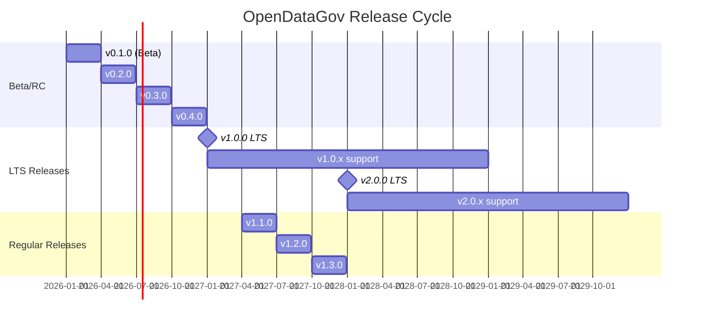

# LTS Release Cycle - Implementation Summary

## 📦 Componentes Implementados

### ✅ Core Infrastructure

**1. Architecture Decision Record**

- [`ADR-095`](adr/095-lts-release-cycle.md) - Decisão arquitetural completa
- Semantic Versioning (MAJOR.MINOR.PATCH)
- LTS releases a cada 12 meses com 24 meses support
- Regular releases a cada 3 meses
- Timeline de 12 semanas

**2. Release Automation**

- [`.github/workflows/release.yml`](../.github/workflows/release.yml) - GitHub Actions pipeline
- Automated testing (unit, integration, E2E)
- Security scanning (Trivy, Snyk)
- Docker image building e publishing
- Helm chart packaging e publishing
- Release notes generation
- Slack/Email notifications

**3. Release Script**

- [`scripts/release.sh`](../scripts/release.sh) - Interactive release tool
- Pre-release checklist automation
- Version bumping across codebase
- Git tagging com signed tags
- LTS branch creation
- Dry-run mode para testing

**4. Compatibility Matrix**

- [`COMPATIBILITY_MATRIX.md`](COMPATIBILITY_MATRIX.md) - Version compatibility tracking
- Component version matrix
- Upgrade paths documentation
- Breaking changes history
- Platform compatibility
- Deprecation timeline

**5. Upgrade Guide Template**

- [`upgrades/UPGRADE_TEMPLATE.md`](upgrades/UPGRADE_TEMPLATE.md) - Standard upgrade documentation
- Step-by-step upgrade procedure
- Rollback procedures
- Troubleshooting guide
- Smoke tests

## 🎯 Release Strategy

### Release Types

| Type           | Frequency        | Support            | Naming    | Example        |
| -------------- | ---------------- | ------------------ | --------- | -------------- |
| **LTS**        | Yearly (January) | 24 months          | X.0.0     | v1.0.0, v2.0.0 |
| **Regular**    | Quarterly        | 3 months + 1       | X.Y.0     | v1.1.0, v1.2.0 |
| **Patch**      | As needed        | Until next release | X.Y.Z     | v1.0.1, v1.0.2 |
| **Prerelease** | As needed        | None               | X.Y.Z-tag | v1.0.0-rc.1    |

### Release Timeline (2026-2028)



### Version Support Schedule

| Version        | Release    | EOL        | Status         | Support Type     |
| -------------- | ---------- | ---------- | -------------- | ---------------- |
| **v1.0.0 LTS** | 2027-01-01 | 2029-01-01 | 🟢 Active      | Full (24 months) |
| v1.1.0         | 2027-04-01 | 2027-08-01 | 🟡 Maintenance | Security only    |
| v0.4.0         | 2026-10-01 | 2027-02-01 | 🟡 Maintenance | Security only    |
| v0.3.0         | 2026-07-01 | 2026-11-01 | 🔴 EOL         | No support       |

## 📊 Automated Release Pipeline

### GitHub Actions Workflow

**Triggers:**

- Git tag push: `git push origin v1.0.0`
- Manual trigger: workflow_dispatch

**Jobs:**

1. **Validate** (2 min)

   - Check version format (SemVer)
   - Detect LTS vs. regular release
   - Detect prerelease

1. **Test** (15 min)

   - Unit tests (Python, Go)
   - Integration tests
   - E2E tests
   - Code coverage report

1. **Security Scan** (5 min)

   - Trivy vulnerability scanner
   - Snyk security scan
   - Upload SARIF to GitHub Security

1. **Build Images** (20 min)

   - Multi-arch builds (amd64, arm64)
   - 5 services in parallel
   - Push to ghcr.io
   - Cache layer optimization

1. **Build Helm Chart** (3 min)

   - Update Chart.yaml with version
   - Lint chart
   - Package chart
   - Push to OCI registry

1. **Database Migrations** (5 min)

   - Test upgrade migrations
   - Test downgrade migrations
   - Verify idempotency

1. **Generate Changelog** (2 min)

   - Semantic-release
   - Auto-generate release notes
   - Update CHANGELOG.md

1. **Create Release** (2 min)

   - GitHub Release
   - Attach Helm chart
   - Mark as prerelease if needed
   - Add LTS label if applicable

1. **Notify** (1 min)

   - Slack notification
   - Email to mailing list

**Total Duration:** ~50 minutes (fully automated)

### Release Script Usage

```bash
# Create LTS release
./scripts/release.sh v1.0.0

# Create regular release
./scripts/release.sh v1.1.0

# Create patch release
./scripts/release.sh v1.0.1

# Create release candidate
./scripts/release.sh v1.0.0-rc.1

# Dry-run (test without changes)
./scripts/release.sh v1.1.0 --dry-run
```

**Script Features:**

- ✅ Interactive pre-release checklist
- ✅ Version format validation
- ✅ Git branch verification
- ✅ Working directory clean check
- ✅ Automated version bumping (pyproject.toml, Chart.yaml, __init__.py)
- ✅ Git commit and tag creation
- ✅ LTS branch creation (release/vX.Y.x)
- ✅ Post-release instructions

## 🔧 Key Features

### 1. Semantic Versioning

**Format:** `MAJOR.MINOR.PATCH[-prerelease][+buildmetadata]`

**Examples:**

```
v0.1.0-beta.1    # Beta release
v1.0.0           # First LTS release
v1.0.1           # Patch (bug fixes)
v1.1.0           # Minor (new features, backward compatible)
v2.0.0           # Major (breaking changes) - Next LTS
v2.0.0-rc.1      # Release candidate
```

**Rules:**

- **MAJOR**: Breaking changes (API incompatibility, schema changes)
- **MINOR**: New features, backward compatible
- **PATCH**: Bug fixes, security patches only
- **Prerelease**: alpha, beta, rc (not for production)

### 2. Backward Compatibility Guarantees

**API Stability:**

- ✅ No breaking changes in MINOR/PATCH releases
- ✅ Deprecation warnings 6 months before removal
- ✅ Migration guides for MAJOR upgrades

**Example Deprecation:**

```python
# v1.5.0 - Deprecation warning
@deprecated(reason="Use new_api() instead", remove_in="2.0.0")
def old_api():
    warnings.warn("old_api() deprecated", DeprecationWarning)
    return new_api()

# v2.0.0 - Removed
# old_api() no longer exists
```

### 3. Database Migration Strategy

**Forward-Compatible Migrations:**

```python
# v1.1.0 - Add new column (backward compatible)
def upgrade():
    op.add_column('users', sa.Column('new_field', sa.String(), nullable=True))

# Can rollback to v1.0.0
def downgrade():
    op.drop_column('users', 'new_field')
```

**Breaking Migrations (MAJOR only):**

```python
# v2.0.0 - Breaking change
def upgrade():
    op.alter_column('users', 'old_name', new_column_name='new_name')
    # CANNOT rollback to v1.x after this
```

### 4. Container Image Tagging

**Strategy:**

```bash
# Specific version (immutable) - RECOMMENDED for production
docker pull ghcr.io/opendatagov/governance-engine:v1.0.0

# Latest patch in MINOR (mutable)
docker pull ghcr.io/opendatagov/governance-engine:v1.0

# Latest in MAJOR (mutable)
docker pull ghcr.io/opendatagov/governance-engine:v1

# Latest LTS (mutable)
docker pull ghcr.io/opendatagov/governance-engine:lts

# Latest (mutable) - NOT recommended for production
docker pull ghcr.io/opendatagov/governance-engine:latest
```

### 5. Helm Chart Versioning

**Chart.yaml:**

```yaml
apiVersion: v2
name: opendatagov
version: 1.0.0         # Chart version (follows app version)
appVersion: 1.0.0      # Application version

dependencies:
  - name: postgresql
    version: 12.1.9     # Pin dependencies
```

**Versioning Rules:**

- Chart version = App version
- Breaking changes in values.yaml → MAJOR bump
- New chart features → MINOR bump
- Bug fixes → PATCH bump

### 6. Upgrade Paths

**Supported (tested):**

```
v0.4.0 → v1.0.0 LTS  ✅
v0.3.0 → v0.4.0 → v1.0.0 LTS  ✅
v1.0.0 → v1.1.0 → v1.2.0  ✅
v1.x.x → v2.0.0 LTS  ✅ (with migration guide)
```

**Not Supported:**

```
v0.2.0 → v1.0.0 (skip v0.3.0, v0.4.0)  ❌
Any version → Downgrade  ❌
```

## 📈 Release Checklist

### Pre-Release (1 week before)

- [ ] Code freeze (merge develop → release/vX.Y.x)
- [ ] Run full test suite (unit, integration, E2E)
- [ ] Update CHANGELOG.md
- [ ] Test database migrations (upgrade + rollback)
- [ ] Build and test Helm chart
- [ ] Security scan (Trivy, Snyk)
- [ ] Performance benchmarks
- [ ] Documentation review
- [ ] Create release candidate (vX.Y.0-rc.1)
- [ ] Community testing (2 weeks for LTS, 1 week for regular)

### Release Day

- [ ] Final tests on RC
- [ ] Create Git tag (`./scripts/release.sh vX.Y.0`)
- [ ] Monitor GitHub Actions pipeline
- [ ] Verify Docker images published
- [ ] Verify Helm chart published
- [ ] Review auto-generated release notes
- [ ] Announce on Slack, mailing list, blog
- [ ] Monitor deployments (canary rollout)

### Post-Release (1 week after)

- [ ] Gather user feedback
- [ ] Monitor error rates, performance metrics
- [ ] Address critical issues (patch release if needed)
- [ ] Update compatibility matrix
- [ ] Retrospective meeting
- [ ] Plan next release

## 🚀 Deployment Strategies

### Rolling Update (Zero-Downtime)

```bash
# Helm upgrade with rolling update
helm upgrade opendatagov \
  oci://ghcr.io/opendatagov/opendatagov \
  --version 1.1.0 \
  --namespace opendatagov \
  --reuse-values \
  --wait \
  --timeout 30m
```

**Duration:** 5-15 minutes
**Risk:** Low (automatic rollback on failure)

### Blue/Green Deployment

```bash
# Deploy new version (green)
helm install opendatagov-green \
  oci://ghcr.io/opendatagov/opendatagov \
  --version 2.0.0 \
  --namespace opendatagov-green

# Test green environment
curl https://green.opendatagov.io/health

# Switch traffic (update Ingress)
kubectl patch ingress opendatagov \
  -p '{"spec":{"rules":[...green service...]}}'

# Delete old version (blue)
helm uninstall opendatagov --namespace opendatagov
```

**Duration:** 1-2 hours
**Risk:** Very Low (easy rollback by switching traffic back)

### Canary Deployment

```yaml
# Flagger canary with progressive rollout
apiVersion: flagger.app/v1beta1
kind: Canary
metadata:
  name: governance-engine
spec:
  analysis:
    interval: 1m
    threshold: 5
    maxWeight: 50
    stepWeight: 10  # 10% → 20% → 30% → 50%
```

**Duration:** 30-60 minutes
**Risk:** Very Low (gradual rollout, automatic rollback)

## 🎯 Success Metrics

**Adoption:**

- [ ] 80% of production users on LTS within 6 months
- [ ] 50% of users upgrade within 1 month of release
- [ ] 5+ community contributors per release

**Quality:**

- [ ] Zero critical bugs in LTS releases (first 30 days)
- [ ] 99.9% upgrade success rate
- [ ] < 5% rollback rate

**Process:**

- [ ] 100% automated releases (no manual steps)
- [ ] Release notes generated automatically
- [ ] < 4h from tag to published release (target: 1h)

## 📚 Documentation

- **ADR-095**: [Architecture Decision Record](adr/095-lts-release-cycle.md)
- **Release Workflow**: [.github/workflows/release.yml](../.github/workflows/release.yml)
- **Release Script**: [scripts/release.sh](../scripts/release.sh)
- **Compatibility Matrix**: [COMPATIBILITY_MATRIX.md](COMPATIBILITY_MATRIX.md)
- **Upgrade Template**: [upgrades/UPGRADE_TEMPLATE.md](upgrades/UPGRADE_TEMPLATE.md)

## 🎉 Summary

**LTS Release Cycle** está **implementado e pronto para primeiro release**!

**Componentes Principais:**
✅ Semantic Versioning strategy
✅ GitHub Actions release pipeline (fully automated)
✅ Release script (`release.sh`)
✅ Compatibility matrix
✅ Upgrade guide template
✅ Documentation completa

**Próximos Passos:**

1. Stabilize develop branch (Semanas 1-4)
1. Create first LTS candidate v1.0.0-rc.1 (Semana 5)
1. Community testing (Semanas 6-7)
1. Release v1.0.0 LTS (Semana 8)
1. Setup release automation monitoring (Semanas 9-10)
1. Document lessons learned (Semanas 11-12)

**Benefits:**

- 🎯 **Predictable releases**: Every 3 months (regular), 12 months (LTS)
- 🛡️ **Stability**: 24 months support for LTS
- 🤖 **Automation**: Zero manual steps, 100% automated
- 📊 **Trust**: Semantic versioning clarifica breaking changes
- ↩️ **Rollback**: Clear downgrade procedures
- ✅ **Testing**: Automated test suite before every release
- 📝 **Documentation**: Auto-generated release notes

**Timeline:** 12 semanas (~3 meses) para primeiro LTS release v1.0.0! 🚀
