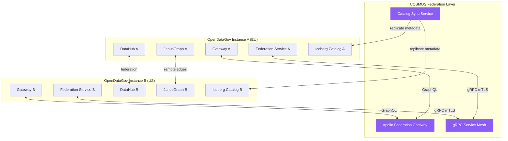

# ADR-092: COSMOS Federation - Multi-Instance Data Sharing

**Status:** Accepted
**Date:** 2026-02-08
**Deciders:** Architecture Team
**Tags:** federation, data-sharing, multi-tenant, governance

## Context

OpenDataGov deployments são isolados por padrão, cada organização/região operando sua própria instância independente. No entanto, casos de uso emergentes requerem:

1. **Cross-Organization Collaboration**: Empresas parceiras compartilhando datasets curated
1. **Multi-Region Deployments**: Replicação de metadata/dados entre regiões (EU/US)
1. **Data Mesh Architecture**: Múltiplos domínios com instâncias separadas, mas descoberta federada
1. **M&A Scenarios**: Integração de empresas adquiridas mantendo instâncias separadas inicialmente

**Limitações Atuais:**

- ❌ Sem descoberta de datasets em outras instâncias
- ❌ Lineage tracking para apenas dentro da instância local
- ❌ Data sharing requer exportação manual + reimportação
- ❌ Sem governance cross-instance

## Decision

Implementar **COSMOS Federation** (Cross-Organization Secure Metadata & Object Sharing), permitindo:

1. **Federated Catalog Discovery**: Descobrir datasets em instâncias remotas via DataHub federation
1. **Remote Lineage Tracking**: JanusGraph edges apontando para datasets/models remotos
1. **Secure Data Sharing**: Compartilhamento governado via Data Sharing Agreements
1. **Snapshot Replication**: Iceberg catalog replication cross-instance (opcional)
1. **Federated Queries**: GraphQL/gRPC queries spanning múltiplas instâncias

## Architecture



### Components

#### 1. Federation Service (Go)

**Responsabilidades:**

- Registrar instância local no federation registry
- Descobrir outras instâncias via service discovery
- Validar data sharing agreements
- Rotear queries para instâncias remotas
- Enforçar access control policies (OPA)

**Endpoints:**

```go
// gRPC API
service FederationService {
  rpc RegisterInstance(InstanceInfo) returns (RegistrationResponse);
  rpc DiscoverInstances(DiscoveryRequest) returns (stream InstanceInfo);
  rpc CreateSharingAgreement(SharingAgreement) returns (AgreementResponse);
  rpc QueryRemoteDataset(RemoteQuery) returns (DatasetMetadata);
  rpc FederatedLineageQuery(LineageRequest) returns (LineageGraph);
}
```

#### 2. Data Sharing Agreement

**Modelo:**

```python
class DataSharingAgreement(BaseModel):
    agreement_id: str
    source_instance_id: str  # Instance que compartilha
    target_instance_id: str  # Instance que consome
    shared_datasets: list[str]  # Dataset IDs permitidos
    access_level: Literal["metadata_only", "read_only", "full"]

    # Governance
    raci_approvals: dict[str, str]  # RACI roles que aprovaram
    compliance_frameworks: list[str]  # GDPR, LGPD, etc.

    # Security
    encryption_required: bool = True
    allowed_ips: list[str] | None = None

    # Lifecycle
    valid_from: datetime
    valid_until: datetime | None = None
    revoked: bool = False
```

#### 3. Federated Catalog (DataHub)

DataHub já suporta federation nativamente via GraphQL stitching. Configuração:

```yaml
# datahub-gms.yaml
federation:
  enabled: true
  remote_instances:
    - instance_id: "opendatagov-us"
      graphql_endpoint: "https://us.opendatagov.example.com/graphql"
      auth:
        type: "mtls"
        cert_path: "/certs/client.crt"
        key_path: "/certs/client.key"
```

#### 4. Remote Lineage (JanusGraph)

**New Edge Type:** `REMOTE_DERIVED_FROM`

```groovy
// Vertex em Instance A referenciando Dataset em Instance B
g.V().hasLabel('Dataset').has('dataset_id', 'gold/customers_local')
  .addE('REMOTE_DERIVED_FROM')
  .to(
    g.addV('RemoteDataset')
      .property('instance_id', 'opendatagov-us')
      .property('remote_dataset_id', 'gold/customers_us')
      .property('federation_url', 'https://us.opendatagov.example.com')
  )
```

**GraphQL Query:**

```graphql
query {
  federatedLineage(
    datasetId: "gold/customers_local",
    includeRemote: true
  ) {
    nodes {
      id
      instanceId  # null = local, valor = remote
      remoteUrl
    }
    edges {
      label
      isRemote
    }
  }
}
```

#### 5. Snapshot Replication (Optional)

Para cenários de disaster recovery ou low-latency access:

```python
class CatalogSyncService:
    """Replica Iceberg catalog metadata between instances."""

    async def sync_catalog(
        self,
        source_instance: str,
        target_instance: str,
        namespace: str,
        table_name: str
    ):
        # 1. Get snapshot metadata from source
        source_catalog = IcebergCatalog(source_instance)
        snapshots = source_catalog.list_snapshots(namespace, table_name)

        # 2. Replicate metadata to target (data permanece no source)
        target_catalog = IcebergCatalog(target_instance)
        for snap in snapshots:
            target_catalog.register_remote_snapshot(
                namespace=namespace,
                table_name=table_name,
                snapshot_metadata=snap,
                source_instance=source_instance
            )
```

## Security Model

### Authentication: mTLS

Todas as comunicações cross-instance usam mutual TLS:

```yaml
# federation-tls.yaml
apiVersion: v1
kind: Secret
metadata:
  name: federation-mtls
type: kubernetes.io/tls
data:
  ca.crt: <root CA certificate>
  tls.crt: <instance client certificate>
  tls.key: <instance private key>
```

### Authorization: OPA Policies

```rego
# federation_authz.rego
package cosmos.federation

default allow = false

# Allow if data sharing agreement exists and is valid
allow {
    input.method == "QueryRemoteDataset"
    agreement := data.sharing_agreements[input.target_instance]
    input.dataset_id in agreement.shared_datasets
    time.now_ns() >= agreement.valid_from
    not agreement.revoked
}

# Allow metadata queries (discovery)
allow {
    input.method == "DiscoverInstances"
    input.access_level == "metadata_only"
}
```

### Encryption

- **In-transit**: mTLS (TLS 1.3)
- **At-rest**: Vault transit encryption para credentials
- **Data sharing**: Opcionalmente, dados podem ser encrypted com target instance's public key

## Use Cases

### Use Case 1: Cross-Organization Data Sharing

**Scenario:** Empresa A (pharma) compartilha clinical trial data com Empresa B (research org)

**Flow:**

```python
# 1. Empresa A cria data sharing agreement
agreement = DataSharingAgreement(
    agreement_id="pharma-research-2026",
    source_instance_id="opendatagov-pharma",
    target_instance_id="opendatagov-research",
    shared_datasets=["gold/clinical_trials", "gold/adverse_events"],
    access_level="metadata_only",  # Apenas metadata, não raw data
    compliance_frameworks=["HIPAA", "GDPR"],
    valid_from=datetime(2026, 2, 1),
    valid_until=datetime(2027, 2, 1)
)

# 2. RACI approval (Data Owner + Compliance Officer)
await governance_engine.approve_sharing_agreement(
    agreement_id=agreement.agreement_id,
    approvers=["data_owner", "compliance_officer"]
)

# 3. Empresa B pode descobrir datasets
federated_client = FederatedCatalogClient()
datasets = await federated_client.discover_datasets(
    instance_id="opendatagov-pharma",
    namespace="gold"
)

# 4. Empresa B query metadata
metadata = await federated_client.query_remote_dataset(
    instance_id="opendatagov-pharma",
    dataset_id="gold/clinical_trials"
)

print(f"Schema: {metadata.schema}")
print(f"Row count: {metadata.row_count}")
print(f"Last updated: {metadata.last_modified}")
```

### Use Case 2: Multi-Region Lineage

**Scenario:** Pipeline em EU Instance usa dados de US Instance

```python
# EU Instance: Spark job processa dados locais + dados US
from odg_core.federation import FederatedDatasetReader

# Ler dataset local
df_eu = spark.read.iceberg("gold.customers_eu")

# Ler dataset remoto (US instance)
reader = FederatedDatasetReader(instance_id="opendatagov-us")
df_us = reader.read("gold.customers_us")

# Join cross-region
df_global = df_eu.union(df_us)

# Salvar resultado
df_global.write.iceberg("gold.customers_global")

# Lineage automaticamente inclui remote edge
# JanusGraph: customers_global → DERIVED_FROM → customers_eu (local)
#                               → REMOTE_DERIVED_FROM → customers_us (remote)
```

### Use Case 3: Data Mesh Federation

**Scenario:** 4 domínios (Sales, Marketing, Product, Finance), cada um com sua instância

```yaml
# cosmos-federation-config.yaml
federation:
  enabled: true
  instances:
    - id: "opendatagov-sales"
      url: "https://sales.opendatagov.internal"
      shared_namespaces: ["gold"]

    - id: "opendatagov-marketing"
      url: "https://marketing.opendatagov.internal"
      shared_namespaces: ["gold", "platinum"]

    - id: "opendatagov-product"
      url: "https://product.opendatagov.internal"
      shared_namespaces: ["gold"]

    - id: "opendatagov-finance"
      url: "https://finance.opendatagov.internal"
      shared_namespaces: ["gold"]
```

**Discovery Query:**

```graphql
query {
  federatedDatasets(
    namespaces: ["gold"],
    domains: ["sales", "marketing", "product", "finance"]
  ) {
    instanceId
    datasetId
    owner
    qualityScore
    tags
  }
}
```

## Implementation Plan

### Phase 1: Core Federation (2 weeks)

- [ ] Federation Service (Go) com gRPC API
- [ ] Data Sharing Agreement model + PostgreSQL table
- [ ] Instance registry (service discovery)
- [ ] mTLS setup + certificate management
- [ ] OPA policies para federation authorization

### Phase 2: Catalog Federation (1 week)

- [ ] DataHub federation configuration
- [ ] Federated catalog client (Python)
- [ ] Remote dataset discovery API
- [ ] GraphQL federated queries (Apollo Gateway)

### Phase 3: Remote Lineage (1 week)

- [ ] JanusGraph remote edges (`REMOTE_DERIVED_FROM`)
- [ ] Federated lineage queries
- [ ] GraphQL schema extension
- [ ] UI visualization para remote nodes

### Phase 4: Data Sharing (2 weeks)

- [ ] RACI approval workflow para sharing agreements
- [ ] Audit logging cross-instance
- [ ] Snapshot replication (optional)
- [ ] Federated dataset reader

### Phase 5: Monitoring & Operations (1 week)

- [ ] Federation health metrics (Prometheus)
- [ ] Grafana dashboard
- [ ] Alert rules (instance unreachable, agreement expired)
- [ ] Federation CLI tool

**Total Timeline:** 7 weeks

## Consequences

### Positive

✅ **Cross-organization collaboration** - Empresas podem compartilhar dados de forma governada
✅ **Multi-region deployments** - Suporte para data residency compliance
✅ **Data Mesh enablement** - Cada domínio mantém autonomia, mas com descoberta global
✅ **Lineage end-to-end** - Rastrear dados cross-instance
✅ **Scalability** - Distribuir load entre múltiplas instâncias

### Negative

⚠️ **Complexity increase** - Mais moving parts, debugging mais difícil
⚠️ **Network dependency** - Queries cross-instance dependem de conectividade
⚠️ **Security surface** - Mais endpoints expostos, requer strong mTLS
⚠️ **Governance overhead** - Data sharing agreements precisam ser gerenciados

### Mitigation

- **Circuit breaker pattern** para tolerar instance failures
- **Caching de metadata** remoto (Redis) para reduzir latência
- **Rate limiting** em federation endpoints
- **Automated certificate rotation** (cert-manager)
- **Clear SLAs** para data sharing agreements

## Alternatives Considered

### 1. Centralized Catalog (Rejected)

Single DataHub instance para todas as organizações/regiões.

**Pros:** Simples, descoberta centralizada
**Cons:** Single point of failure, não atende data residency, vendor lock-in

### 2. Manual Data Export/Import (Status Quo)

Sem federation, cada instância isolada.

**Pros:** Seguro, sem complexidade
**Cons:** Não escala, lineage quebrado, manual overhead

### 3. Full Data Replication (Rejected)

Replicar todos os dados entre instâncias.

**Pros:** Low latency, local queries
**Cons:** Compliance issues (GDPR), storage cost, data consistency

## References

- [DataHub Federation](https://docs.datahub.com/docs/architecture/architecture#federated-metadata-serving)
- [Apollo Federation](https://www.apollographql.com/docs/federation/)
- [JanusGraph Remote Connections](https://docs.janusgraph.org/configs/example-config/#cassandra-remote)
- [NIST Data Sharing Guidelines](https://www.nist.gov/privacy-framework)
- [GDPR Cross-Border Data Transfers](https://gdpr-info.eu/art-45-gdpr/)

## Decision Log

- **2026-02-08**: ADR created and accepted
- **Implementation Start**: 2026-02-10 (Phase 1)
