# ADR-093: Advanced Multi-Expert Orchestration

**Status:** Accepted
**Date:** 2026-02-08
**Deciders:** Architecture Team
**Tags:** ai, orchestration, multi-agent, experts, workflows

## Context

O `data-expert` atual fornece recomendações AI para decisões de governança, mas é limitado a um único "expert generalista". Casos de uso emergentes requerem:

1. **Especialização**: Diferentes tipos de análise (schema, quality, security, compliance) requerem expertise específica
1. **Workflows Complexos**: Tarefas como "onboard new dataset" envolvem múltiplos passos sequenciais
1. **Colaboração**: Experts precisam compartilhar contexto e resultados intermediários
1. **Escalabilidade**: Paralelizar análises independentes para reduzir latência

**Limitações Atuais:**

- ❌ Um único expert "faz tudo" (baixa qualidade em análises especializadas)
- ❌ Sem orquestração de workflows multi-step
- ❌ Sem compartilhamento de contexto entre análises
- ❌ Não escala para análises paralelas

## Decision

Implementar **Advanced Multi-Expert Orchestration**, um sistema de orquestração de múltiplos AI experts especializados trabalhando em workflows colaborativos (DAG-based).

### Expert Types

| Expert                | Especialização                                 | LLM Backend            | Rationale                                                                            |
| --------------------- | ---------------------------------------------- | ---------------------- | ------------------------------------------------------------------------------------ |
| **SchemaExpert**      | Schema analysis, type inference, normalization | **GPT-5.2 (Thinking)** | Latest reasoning flagship for complex schema inference with extended thought process |
| **QualityExpert**     | Data quality expectations, anomaly detection   | **Claude Sonnet 4.6**  | Latest mid-tier model with 200K context for nuanced quality pattern analysis         |
| **LineageExpert**     | Lineage pattern analysis, impact assessment    | **Gemini 3**           | Latest multimodal with native spatial reasoning for graph/relationship analysis      |
| **PerformanceExpert** | Query optimization, resource tuning            | **GPT-5.2 (Instant)**  | Latest flagship in fast mode for rapid optimization recommendations                  |
| **SecurityExpert**    | PII detection, vulnerability scanning          | **Claude Opus 4.6**    | Latest flagship with 1M token context (beta) for superior pattern recognition        |
| **ComplianceExpert**  | Regulatory validation (GDPR, HIPAA, LGPD)      | **Claude Opus 4.6**    | Latest flagship with extended thinking for complex legal/compliance analysis         |
| **CostExpert**        | FinOps analysis, cost optimization             | **GPT-5.2 (Instant)**  | Latest flagship for rapid numerical analysis & cost calculations                     |

### Architecture

```mermaid
graph TB
    subgraph User_Interface["User Interface"]
        UI[Web UI / SDK / CLI]
    end

    subgraph Orchestrator["Expert Orchestrator Service"]
        API[REST + GraphQL API]
        ROUTER[Expert Router]
        WORKFLOW[Workflow Engine<br/>DAG Executor]
        CONTEXT[Context Manager<br/>Shared Memory]
    end

    subgraph Expert_Registry["Expert Registry"]
        REG[Expert Catalog<br/>Capabilities, Availability]
    end

    subgraph Experts["Specialized Experts (Feb 2026)"]
        SCHEMA[Schema Expert<br/>GPT-5.2 Thinking]
        QUALITY[Quality Expert<br/>Claude Sonnet 4.6]
        LINEAGE[Lineage Expert<br/>Gemini 3]
        PERF[Performance Expert<br/>GPT-5.2 Instant]
        SEC[Security Expert<br/>Claude Opus 4.6]
        COMP[Compliance Expert<br/>Claude Opus 4.6]
        COST[Cost Expert<br/>GPT-5.2 Instant]
    end

    subgraph Knowledge_Base["Expert Knowledge Base"]
        VECTOR[Qdrant Vector DB<br/>Expert Knowledge]
        CACHE[Redis Cache<br/>Recent Analysis]
    end

    subgraph Event_Bus["Event Bus"]
        KAFKA[Kafka<br/>Expert Communication]
    end

    UI -->|request| API
    API --> ROUTER
    ROUTER -->|select experts| REG
    ROUTER --> WORKFLOW
    WORKFLOW --> CONTEXT

    WORKFLOW -->|task| SCHEMA
    WORKFLOW -->|task| QUALITY
    WORKFLOW -->|task| LINEAGE
    WORKFLOW -->|task| PERF
    WORKFLOW -->|task| SEC
    WORKFLOW -->|task| COMP
    WORKFLOW -->|task| COST

    SCHEMA -.->|query knowledge| VECTOR
    QUALITY -.->|query knowledge| VECTOR
    LINEAGE -.->|query knowledge| VECTOR
    PERF -.->|query knowledge| VECTOR
    SEC -.->|query knowledge| VECTOR
    COMP -.->|query knowledge| VECTOR
    COST -.->|query knowledge| VECTOR

    SCHEMA -.->|share context| CONTEXT
    QUALITY -.->|share context| CONTEXT
    LINEAGE -.->|share context| CONTEXT
    PERF -.->|share context| CONTEXT
    SEC -.->|share context| CONTEXT
    COMP -.->|share context| CONTEXT
    COST -.->|share context| CONTEXT

    SCHEMA -->|publish event| KAFKA
    QUALITY -->|publish event| KAFKA
    LINEAGE -->|publish event| KAFKA
    PERF -->|publish event| KAFKA
    SEC -->|publish event| KAFKA
    COMP -->|publish event| KAFKA
    COST -->|publish event| KAFKA

    classDef orchestrator fill:#8B5CF6,stroke:#7C3AED,color:#fff
    classDef expert fill:#10B981,stroke:#059669,color:#fff
    classDef storage fill:#F59E0B,stroke:#D97706,color:#fff

    class ROUTER,WORKFLOW,CONTEXT orchestrator
    class SCHEMA,QUALITY,LINEAGE,PERF,SEC,COMP,COST expert
    class VECTOR,CACHE,KAFKA storage
```



## Use Cases

### Use Case 1: Dataset Onboarding Workflow

**User Request:** "Onboard new `customer_transactions` dataset from S3"

**Workflow DAG:**

```python
{
    "workflow_id": "onboard_customer_transactions",
    "tasks": [
        {
            "id": "schema_analysis",
            "expert": "SchemaExpert",
            "action": "analyze_schema",
            "inputs": {"file_path": "s3://data/customer_transactions.parquet"}
        },
        {
            "id": "quality_validation",
            "expert": "QualityExpert",
            "action": "define_expectations",
            "depends_on": ["schema_analysis"]
        },
        {
            "id": "security_scan",
            "expert": "SecurityExpert",
            "action": "detect_pii",
            "depends_on": ["schema_analysis"]
        },
        {
            "id": "compliance_check",
            "expert": "ComplianceExpert",
            "action": "validate_gdpr",
            "depends_on": ["security_scan"]
        },
        {
            "id": "cost_estimation",
            "expert": "CostExpert",
            "action": "estimate_storage_cost",
            "depends_on": ["schema_analysis"]
        },
        {
            "id": "lineage_mapping",
            "expert": "LineageExpert",
            "action": "map_dependencies",
            "depends_on": ["schema_analysis"]
        }
    ]
}
```

**Execution:**

```
1. SchemaExpert: Analyze schema
   └─> Found: 15 columns, 3 PII candidates, 2M rows

2. [Parallel Execution]
   ├─> QualityExpert: Define expectations
   │   └─> Created 12 GE expectations
   ├─> SecurityExpert: Detect PII
   │   └─> Found PII: email, phone, ssn
   └─> CostExpert: Estimate costs
       └─> Storage: $120/mo, Compute: $45/mo

3. ComplianceExpert: Validate GDPR (depends on SecurityExpert)
   └─> Requires: data retention policy, consent tracking

4. LineageExpert: Map dependencies
   └─> Upstream: orders, customers tables

Final Report:
  ✅ Schema validated
  ⚠️  3 PII fields require masking
  ⚠️  GDPR compliance pending (retention policy)
  💰 Estimated cost: $165/month
  🔗 Depends on 2 upstream datasets
```

### Use Case 2: Performance Troubleshooting

**User Request:** "Spark pipeline `transform_sales` taking 4h, should be 30min"

**Workflow DAG:**

```python
{
    "workflow_id": "troubleshoot_transform_sales",
    "tasks": [
        {
            "id": "performance_analysis",
            "expert": "PerformanceExpert",
            "action": "analyze_execution_plan",
            "inputs": {"pipeline_id": "transform_sales"}
        },
        {
            "id": "lineage_analysis",
            "expert": "LineageExpert",
            "action": "identify_bottleneck_datasets",
            "depends_on": ["performance_analysis"]
        },
        {
            "id": "quality_analysis",
            "expert": "QualityExpert",
            "action": "check_data_skew",
            "depends_on": ["lineage_analysis"]
        },
        {
            "id": "cost_optimization",
            "expert": "CostExpert",
            "action": "suggest_resource_optimization",
            "depends_on": ["performance_analysis"]
        }
    ]
}
```

**Expert Outputs:**

```
PerformanceExpert:
  - Identified: 500 partitions, only 50 active (data skew)
  - Shuffle write: 2.5TB (excessive)
  - GC time: 35% of total time

LineageExpert:
  - Bottleneck: bronze/sales table (not partitioned)
  - Downstream impact: 5 pipelines delayed

QualityExpert:
  - Data skew detected: 90% of data in 10% of partitions
  - Suggested: Re-partition by date column

CostExpert:
  - Current cost: $45/run (4h * 3 executors * $3.75/h)
  - Optimized: $5.60/run (30min * 3 executors)
  - Savings: 87.5% ($39.40/run)

Recommendations:
  1. Partition bronze/sales by date
  2. Increase executor memory (reduce GC)
  3. Use dynamic partition pruning
  4. Estimated improvement: 4h → 25min
```

### Use Case 3: Compliance Audit Preparation

**User Request:** "Prepare for GDPR audit - full data inventory"

**Workflow DAG:**

```python
{
    "workflow_id": "gdpr_audit_preparation",
    "tasks": [
        {
            "id": "security_inventory",
            "expert": "SecurityExpert",
            "action": "list_pii_datasets"
        },
        {
            "id": "lineage_tracing",
            "expert": "LineageExpert",
            "action": "trace_pii_data_flows",
            "depends_on": ["security_inventory"]
        },
        {
            "id": "compliance_validation",
            "expert": "ComplianceExpert",
            "action": "validate_data_retention",
            "depends_on": ["security_inventory"]
        },
        {
            "id": "quality_verification",
            "expert": "QualityExpert",
            "action": "verify_anonymization",
            "depends_on": ["security_inventory"]
        }
    ]
}
```

## Implementation Components

### 1. Expert Registry

**Model:**

```python
from pydantic import BaseModel
from enum import Enum

class ExpertCapability(str, Enum):
    SCHEMA_ANALYSIS = "schema_analysis"
    QUALITY_VALIDATION = "quality_validation"
    LINEAGE_TRACING = "lineage_tracing"
    PERFORMANCE_TUNING = "performance_tuning"
    SECURITY_SCANNING = "security_scanning"
    COMPLIANCE_CHECKING = "compliance_checking"
    COST_OPTIMIZATION = "cost_optimization"

class ExpertRegistration(BaseModel):
    expert_id: str
    expert_name: str
    capabilities: list[ExpertCapability]
    llm_backend: str  # "gpt-4-turbo", "claude-3.5-sonnet"
    max_concurrent_tasks: int
    average_latency_ms: int
    status: str  # "available", "busy", "offline"
```

### 2. Workflow Engine

**DAG Execution:**

```python
import asyncio
from typing import Dict, Any

class WorkflowEngine:
    """Executes DAG-based expert workflows."""

    async def execute_workflow(self, workflow_def: dict) -> dict:
        """Execute workflow with dependency resolution."""
        tasks = workflow_def["tasks"]
        results = {}
        context = SharedContext()

        # Build dependency graph
        graph = self._build_dag(tasks)

        # Topological sort
        execution_order = self._topological_sort(graph)

        for level in execution_order:
            # Execute tasks in parallel within same level
            level_tasks = [
                self._execute_task(task, results, context)
                for task in level
            ]
            level_results = await asyncio.gather(*level_tasks)

            # Store results
            for task, result in zip(level, level_results):
                results[task["id"]] = result

        return {
            "workflow_id": workflow_def["workflow_id"],
            "status": "completed",
            "results": results
        }
```

### 3. Context Manager

**Shared Memory:**

```python
class SharedContext:
    """Shares context between experts during workflow execution."""

    def __init__(self):
        self._store = {}
        self._lock = asyncio.Lock()

    async def set(self, key: str, value: Any):
        async with self._lock:
            self._store[key] = value

    async def get(self, key: str) -> Any:
        async with self._lock:
            return self._store.get(key)

    async def get_all(self) -> dict:
        async with self._lock:
            return self._store.copy()
```

### 4. Expert Router

**Dynamic Routing:**

```python
class ExpertRouter:
    """Routes tasks to appropriate experts based on capabilities."""

    def __init__(self, registry: ExpertRegistry):
        self.registry = registry

    async def route_task(self, task: dict) -> str:
        """Select best expert for task."""
        required_capability = task["action"]
        expert_type = task.get("expert")

        if expert_type:
            # Explicit expert requested
            return await self.registry.get_expert(expert_type)
        else:
            # Auto-select based on capability
            experts = await self.registry.find_experts_by_capability(
                required_capability
            )

            # Select least busy expert
            return min(
                experts,
                key=lambda e: e.current_load / e.max_concurrent_tasks
            )
```

## Technology Stack

| Component           | Technology                | Purpose                         |
| ------------------- | ------------------------- | ------------------------------- |
| **Orchestrator**    | FastAPI (Python)          | REST + GraphQL API              |
| **Workflow Engine** | LangGraph                 | DAG execution, state management |
| **LLM Backends**    | OpenAI API, Anthropic API | Expert reasoning                |
| **Vector DB**       | Qdrant                    | Expert knowledge base, RAG      |
| **Message Queue**   | Kafka                     | Async expert communication      |
| **Cache**           | Redis                     | Recent analysis results         |
| **Observability**   | OpenTelemetry             | Tracing multi-expert workflows  |

## Security & Governance

**Access Control:**

- Each expert has OPA policies defining what data it can access
- Compliance expert has read-only access to all metadata
- Security expert can flag datasets but not modify

**Audit Trail:**

- Every expert invocation logged to Kafka (`odg.expert.invocations`)
- Full workflow execution trace in PostgreSQL
- LLM prompts and responses stored (anonymized)

**Rate Limiting:**

- Per-user limits: 100 expert requests/hour
- Per-expert limits: Prevent LLM API quota exhaustion
- Circuit breaker for failed experts

## Performance Considerations

**Latency:**

- **Sequential workflow**: Sum of expert latencies (~30s total)
- **Parallel workflow**: Max expert latency (~10s)
- **Caching**: Redis cache for repeated queries (~50ms)

**Cost:**

- **OpenAI GPT-4 Turbo**: $10 / 1M tokens
- **Anthropic Claude 3.5 Sonnet**: $3 / 1M tokens
- **Estimated cost per workflow**: $0.05 - $0.20

**Scalability:**

- Horizontal scaling: Multiple orchestrator replicas
- Expert pooling: N instances per expert type
- Async execution: Non-blocking workflow engine

## Implementation Plan

### Phase 1: Core Infrastructure (3 weeks)

- [ ] Expert Registry + PostgreSQL schema
- [ ] Workflow Engine (LangGraph integration)
- [ ] Context Manager (shared memory)
- [ ] Expert Router (capability matching)
- [ ] REST API endpoints

### Phase 2: Expert Implementations (4 weeks)

- [ ] SchemaExpert (GPT-4 Turbo)
- [ ] QualityExpert (Claude 3.5)
- [ ] LineageExpert (GPT-4 Turbo)
- [ ] PerformanceExpert (Claude 3.5)
- [ ] SecurityExpert (GPT-4 Turbo)
- [ ] ComplianceExpert (Claude 3.5)
- [ ] CostExpert (GPT-4 Turbo)

### Phase 3: Knowledge Base (2 weeks)

- [ ] Qdrant vector DB setup
- [ ] Expert knowledge ingestion (docs, examples)
- [ ] RAG (Retrieval-Augmented Generation) integration
- [ ] Knowledge versioning

### Phase 4: Workflows & Templates (2 weeks)

- [ ] Pre-built workflow templates (onboarding, troubleshooting, audit)
- [ ] Workflow validation (DAG cycles, missing deps)
- [ ] Workflow versioning
- [ ] UI for workflow builder

### Phase 5: Testing & Deployment (2 weeks)

- [ ] Integration tests (multi-expert workflows)
- [ ] Load testing (concurrent workflows)
- [ ] Cost monitoring (LLM API usage)
- [ ] Helm chart deployment

**Total Timeline:** 13 weeks (~3 months)

## Consequences

### Positive

✅ **Specialized Expertise** - Each expert excels in specific domain
✅ **Parallel Execution** - Reduced latency via concurrent experts
✅ **Flexibility** - Custom workflows for diverse use cases
✅ **Context Sharing** - Experts collaborate via shared memory
✅ **Scalability** - Horizontal scaling per expert type

### Negative

⚠️ **Complexity** - DAG orchestration adds operational overhead
⚠️ **Cost** - Multiple LLM API calls per workflow
⚠️ **Latency** - Sequential workflows can be slow
⚠️ **Debugging** - Harder to trace multi-expert failures

### Mitigation

- **Cost control**: Cache results, rate limiting, budget alerts
- **Latency optimization**: Parallelize independent tasks, use faster models
- **Observability**: OpenTelemetry tracing, Grafana dashboards
- **Testing**: Comprehensive integration tests for workflows

## Alternatives Considered

### 1. Single "Super Expert" (Status Quo)

**Pros:** Simple, low cost
**Cons:** Poor specialization, doesn't scale

### 2. Human-in-the-Loop Orchestration

**Pros:** Maximum control
**Cons:** Slow, doesn't scale, manual overhead

### 3. Hardcoded Workflows

**Pros:** Predictable, easy to debug
**Cons:** Not flexible, requires code changes for new workflows

## References

- [LangGraph Documentation](https://python.langchain.com/docs/langgraph)
- [OpenAI Function Calling](https://platform.openai.com/docs/guides/function-calling)
- [Anthropic Claude for Agents](https://docs.anthropic.com/claude/docs/agents)
- [Multi-Agent Systems](https://arxiv.org/abs/2308.08155)

## Decision Log

- **2026-02-08**: ADR created and accepted
- **Implementation Start**: 2026-02-11 (Phase 1)
