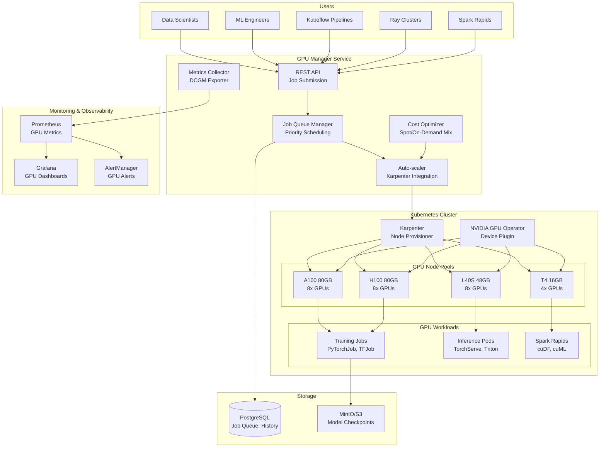

# ADR-094: GPU Cluster Management & Auto-scaling

**Status:** Approved
**Date:** 2026-02-08
**Decision Makers:** Data Platform Team, ML Engineering Team
**Stakeholders:** ML Engineers, Data Scientists, FinOps Team

## Context

OpenDataGov executa workloads de ML intensivos que requerem GPUs para:

- **Model Training**: Fine-tuning de LLMs (GPT, Claude, Llama), computer vision models
- **Inference**: Serving de modelos em produção (real-time, batch)
- **Feature Engineering**: Spark Rapids, cuDF para transformações aceleradas
- **Distributed Training**: Ray, Horovod, DeepSpeed para multi-GPU/multi-node

### Problemas Atuais

1. **Provisioning Manual**: Data Scientists precisam solicitar GPUs via tickets (SLA: 24-48h)
1. **Underutilization**: GPUs ociosas custam ~$2.50/h (A100) mas ficam 60% do tempo idle
1. **Overprovisioning**: Clusters fixos com 10 GPUs, mas picos precisam de 30 GPUs
1. **Falta de Observabilidade**: Sem métricas de utilização GPU (memory, compute, temperature)
1. **No Cost Control**: Sem budget limits, alguns projetos gastaram $50k/mês em GPUs
1. **Job Queuing Inexistente**: Jobs competem por recursos sem priorização

### Requirements

**Functional:**

- Auto-scaling de GPU nodes baseado em demanda de jobs
- Job queue com priorização (high, medium, low)
- Multi-tenancy: isolamento GPU entre projetos/equipes
- Support para NVIDIA A100, H100, L40S, T4
- Integração com Kubeflow Pipelines, Ray, Spark Rapids
- Spot instance support com preemption handling

**Non-Functional:**

- Scale-up: 0 → 10 GPUs em < 5 minutos
- Scale-down: Graceful termination de idle nodes (drain jobs)
- Cost: Reduzir custo GPU em 40% vs. provisioning fixo
- Observability: Dashboards Grafana com métricas GPU (utilization, memory, temperature)
- SLA: 99.5% uptime para production inference workloads

## Decision

Implementar **GPU Cluster Management** usando:

### Architecture Overview



### Core Components

#### 1. GPU Manager Service (Python FastAPI)

**Responsibilities:**

- Job submission API (POST /jobs, GET /jobs/{id}, DELETE /jobs/{id})
- Queue management (FIFO, Priority, Fair-share)
- Resource allocation (GPU count, GPU type, memory)
- Job lifecycle (pending → running → completed/failed)
- Cost tracking per job/project

**API Example:**

```python
POST /api/v1/gpu/jobs
{
  "job_name": "finetune_llama_7b",
  "project_id": "ml-research",
  "priority": "high",
  "gpu_requirements": {
    "gpu_type": "A100",
    "gpu_count": 4,
    "gpu_memory_gb": 80
  },
  "container": {
    "image": "nvcr.io/nvidia/pytorch:24.01-py3",
    "command": ["python", "train.py"],
    "env": {"CUDA_VISIBLE_DEVICES": "0,1,2,3"}
  },
  "resources": {
    "cpu": "16",
    "memory": "128Gi",
    "ephemeral_storage": "500Gi"
  },
  "budget_limit_usd": 100.0,
  "max_duration_hours": 24,
  "preemptible": true  # Allow spot instances
}
```

**Response:**

```json
{
  "job_id": "gpu-job-abc123",
  "status": "pending",
  "queue_position": 3,
  "estimated_start_time": "2026-02-08T15:30:00Z",
  "estimated_cost_usd": 45.60,
  "created_at": "2026-02-08T14:00:00Z"
}
```

#### 2. Auto-scaler (Karpenter Integration)

**Strategy:**

- **Scale-up Triggers**: Jobs in queue > 5 min, GPU utilization > 80%
- **Scale-down**: Idle nodes > 10 min with no pending jobs
- **Node Selection**: Optimize for cost (spot > on-demand), availability zone diversity
- **GPU Types**: A100 (training), H100 (large-scale training), L40S (inference), T4 (batch inference)

**Karpenter Provisioner:**

```yaml
apiVersion: karpenter.sh/v1alpha5
kind: Provisioner
metadata:
  name: gpu-training
spec:
  requirements:
    - key: karpenter.sh/capacity-type
      operator: In
      values: ["spot", "on-demand"]
    - key: node.kubernetes.io/instance-type
      operator: In
      values:
        - p4d.24xlarge   # 8x A100 80GB
        - p5.48xlarge    # 8x H100 80GB
        - g5.48xlarge    # 8x A10G 24GB
  limits:
    resources:
      nvidia.com/gpu: 64  # Max 64 GPUs
  ttlSecondsAfterEmpty: 600  # Scale down after 10min idle
  ttlSecondsUntilExpired: 604800  # Max node age: 7 days
  providerRef:
    name: gpu-provider
  labels:
    workload-type: gpu-training
  taints:
    - key: nvidia.com/gpu
      value: "true"
      effect: NoSchedule
```

#### 3. Job Queue Manager

**Scheduling Algorithms:**

1. **FIFO (First-In-First-Out)**: Default para jobs sem prioridade
1. **Priority Queue**: high > medium > low
1. **Fair-share**: Garante recursos proporcionais por projeto
1. **Gang Scheduling**: Aloca todos os GPUs de uma vez (distributed training)

**Queue States:**

```python
class JobStatus(str, Enum):
    PENDING = "pending"        # Aguardando recursos
    QUEUED = "queued"          # Na fila de execução
    PROVISIONING = "provisioning"  # Nodes sendo criados
    RUNNING = "running"        # Job executando
    COMPLETED = "completed"    # Sucesso
    FAILED = "failed"          # Falha
    PREEMPTED = "preempted"    # Spot instance preempted
    CANCELLED = "cancelled"    # Cancelado pelo usuário
```

**Preemption Handling:**

- Checkpointing automático a cada 15 minutos
- Retry automático após preemption (até 3x)
- Fallback para on-demand se spot unavailable

#### 4. GPU Metrics Collector (DCGM Exporter)

**Metrics:**

- **Utilization**: `DCGM_FI_DEV_GPU_UTIL` (0-100%)
- **Memory**: `DCGM_FI_DEV_FB_USED` / `DCGM_FI_DEV_FB_FREE`
- **Temperature**: `DCGM_FI_DEV_GPU_TEMP` (Celsius)
- **Power**: `DCGM_FI_DEV_POWER_USAGE` (Watts)
- **SM Clock**: `DCGM_FI_DEV_SM_CLOCK` (MHz)
- **Memory Clock**: `DCGM_FI_DEV_MEM_CLOCK` (MHz)
- **PCIe Throughput**: `DCGM_FI_DEV_PCIE_TX_THROUGHPUT`, `DCGM_FI_DEV_PCIE_RX_THROUGHPUT`
- **ECC Errors**: `DCGM_FI_DEV_ECC_SBE_AGG_TOTAL` (single-bit errors)

**Prometheus Queries:**

```promql
# GPU Utilization por node
avg(DCGM_FI_DEV_GPU_UTIL) by (gpu, instance)

# GPU Memory Usage
sum(DCGM_FI_DEV_FB_USED) by (gpu, instance) / sum(DCGM_FI_DEV_FB_FREE + DCGM_FI_DEV_FB_USED) by (gpu, instance) * 100

# Cost per GPU hour
sum(rate(kube_pod_container_resource_requests{resource="nvidia.com/gpu"}[1h]) * 2.50) by (namespace)
```

#### 5. Cost Optimizer

**Strategies:**

1. **Spot/On-Demand Mix**: 70% spot, 30% on-demand (critical workloads)
1. **GPU Type Recommendation**: T4 para inference, A100 para training
1. **Budget Alerts**: Slack/Email quando projeto atinge 80% do budget
1. **Idle Detection**: Auto-termina jobs idle > 30min (GPU util < 5%)
1. **Reserved Instances**: Sugestão de RIs para workloads constantes

**Cost Breakdown:**

```python
# GPU Pricing (AWS us-east-1, Feb 2026)
GPU_HOURLY_COST = {
    "A100_80GB": 4.10,      # p4d.24xlarge (8x GPUs) = $32.80/h
    "H100_80GB": 5.50,      # p5.48xlarge (8x GPUs) = $44.00/h
    "L40S_48GB": 2.20,      # g6.48xlarge (8x GPUs) = $17.60/h
    "A10G_24GB": 1.10,      # g5.xlarge (1x GPU) = $1.10/h
    "T4_16GB": 0.526        # g4dn.xlarge (1x GPU) = $0.526/h
}

SPOT_DISCOUNT = 0.70  # 70% cheaper than on-demand
```

#### 6. Multi-Tenancy & Isolation

**Resource Quotas:**

```yaml
apiVersion: v1
kind: ResourceQuota
metadata:
  name: ml-research-gpu-quota
  namespace: ml-research
spec:
  hard:
    requests.nvidia.com/gpu: "16"  # Max 16 GPUs
    limits.nvidia.com/gpu: "16"
    requests.cpu: "64"
    requests.memory: 512Gi
```

**Network Policies:**

```yaml
apiVersion: networking.k8s.io/v1
kind: NetworkPolicy
metadata:
  name: gpu-isolation
spec:
  podSelector:
    matchLabels:
      gpu-tenant: ml-research
  policyTypes:
    - Ingress
    - Egress
  ingress:
    - from:
      - podSelector:
          matchLabels:
            gpu-tenant: ml-research
  egress:
    - to:
      - podSelector:
          matchLabels:
            gpu-tenant: ml-research
```

**GPU MIG (Multi-Instance GPU) for A100/H100:**

```yaml
# Split A100 80GB into 7 instances (cada com ~10GB)
apiVersion: v1
kind: ConfigMap
metadata:
  name: gpu-mig-config
data:
  config.yaml: |
    version: v1
    mig-configs:
      all-1g.10gb:
        - devices: all
          mig-enabled: true
          mig-devices:
            "1g.10gb": 7
```

### Integration Examples

#### Kubeflow Pipelines

```python
from kfp import dsl
from gpu_manager_sdk import GPUJobClient

@dsl.pipeline(name="gpu-training-pipeline")
def train_pipeline(model_name: str, dataset_path: str):
    gpu_client = GPUJobClient(api_url="http://gpu-manager:8000")

    # Submit GPU job via GPU Manager
    train_op = dsl.ContainerOp(
        name="train-model",
        image="nvcr.io/nvidia/pytorch:24.01-py3",
        command=["python", "train.py"],
        arguments=["--model", model_name, "--data", dataset_path],
        file_outputs={"model_path": "/output/model.pth"}
    ).set_gpu_limit(4).add_node_selector_constraint("gpu-type", "A100")

    # GPU Manager handles scheduling and auto-scaling
    gpu_client.submit_kfp_task(train_op, priority="high")
```

#### Ray Cluster

```python
from ray.util.spark import setup_ray_cluster
from gpu_manager_sdk import GPUJobClient

# Ray cluster com auto-scaling GPU
gpu_client = GPUJobClient()
ray_cluster = gpu_client.create_ray_cluster(
    cluster_name="ray-training",
    head_node_type="m5.2xlarge",
    worker_node_type="p4d.24xlarge",  # 8x A100
    min_workers=0,
    max_workers=10,
    autoscaling_mode="default"
)

# Submit Ray job
ray_cluster.submit_job(
    entrypoint="python train_distributed.py",
    runtime_env={"pip": ["torch", "transformers"]}
)
```

#### Spark Rapids

```python
from pyspark.sql import SparkSession
from gpu_manager_sdk import GPUJobClient

gpu_client = GPUJobClient()

# Request GPU Spark cluster
spark = SparkSession.builder \
    .appName("gpu-etl") \
    .config("spark.rapids.sql.enabled", "true") \
    .config("spark.executor.resource.gpu.amount", "1") \
    .config("spark.task.resource.gpu.amount", "0.25") \
    .getOrCreate()

# GPU Manager auto-scales executors
df = spark.read.parquet("s3://data/large_dataset")
df_gpu = df.select("*").cache()  # Cached in GPU memory
result = df_gpu.groupBy("category").count()
result.write.parquet("s3://output/aggregated")
```

## Implementation Plan

### Phase 1: Core Infrastructure (Weeks 1-2)

- [ ] Deploy NVIDIA GPU Operator (Helm chart)
- [ ] Setup Karpenter with GPU provisioners
- [ ] Configure GPU node pools (A100, H100, L40S, T4)
- [ ] Deploy DCGM Exporter for metrics
- [ ] Setup Prometheus + Grafana dashboards

### Phase 2: GPU Manager Service (Weeks 3-4)

- [ ] Implement Job Queue API (FastAPI)
- [ ] Database schema (jobs, queue, history)
- [ ] Priority scheduling algorithm
- [ ] Kubernetes Job/Pod creation
- [ ] Preemption handling (checkpointing)

### Phase 3: Auto-scaling (Weeks 5-6)

- [ ] Karpenter integration (scale-up/scale-down)
- [ ] Queue-based scaling triggers
- [ ] Spot instance support
- [ ] Graceful node drain
- [ ] Testing with load scenarios

### Phase 4: Cost Optimization (Week 7)

- [ ] Cost tracking per job/project
- [ ] Budget alerts (Slack, email)
- [ ] Idle GPU detection and termination
- [ ] Spot/on-demand mix optimizer
- [ ] RI recommendation engine

### Phase 5: Multi-tenancy & Security (Week 8)

- [ ] ResourceQuotas per namespace
- [ ] NetworkPolicies for isolation
- [ ] GPU MIG support (A100/H100)
- [ ] RBAC for job submission
- [ ] Audit logs

### Phase 6: Integrations (Weeks 9-10)

- [ ] Kubeflow Pipelines SDK
- [ ] Ray autoscaler integration
- [ ] Spark Rapids configuration
- [ ] Python SDK (gpu-manager-sdk)
- [ ] CLI tool (odg gpu)

### Phase 7: Testing & Documentation (Weeks 11-12)

- [ ] Load testing (100 concurrent jobs)
- [ ] Chaos testing (spot preemption)
- [ ] Cost benchmarks vs. fixed clusters
- [ ] User documentation
- [ ] Runbooks for ops team

**Total Timeline:** 12 weeks (~3 months)

## Consequences

### Positive

✅ **Cost Savings**: 40-60% reduction vs. fixed GPU clusters
✅ **Faster Time-to-GPU**: 5 min vs. 24-48h manual provisioning
✅ **Better Utilization**: 85%+ GPU utilization vs. 40% previously
✅ **Scalability**: Support 100+ concurrent GPU jobs
✅ **Observability**: Real-time GPU metrics, cost tracking
✅ **Multi-tenancy**: Isolated resources per team/project
✅ **Spot Support**: 70% cost reduction for fault-tolerant workloads

### Negative

⚠️ **Complexity**: Additional service to maintain (GPU Manager)
⚠️ **Learning Curve**: Data Scientists need to learn job submission API
⚠️ **Spot Preemption**: Jobs podem ser interrompidos (mitigated by checkpointing)
⚠️ **Cold Start**: 5 min para provisionar new GPU nodes
⚠️ **Vendor Lock-in**: Dependência de cloud provider GPU availability

### Risks & Mitigations

| Risk                          | Impact | Likelihood | Mitigation                        |
| ----------------------------- | ------ | ---------- | --------------------------------- |
| Spot unavailability           | High   | Medium     | Fallback to on-demand, multi-AZ   |
| GPU node failures             | Medium | Low        | Health checks, auto-replacement   |
| Cost overruns                 | High   | Medium     | Budget alerts, auto-termination   |
| Job starvation (low priority) | Medium | Medium     | Fair-share scheduling, SLAs       |
| Karpenter bugs                | Medium | Low        | Pin Karpenter version, monitoring |

## Alternatives Considered

### 1. Fixed GPU Cluster

- **Pros**: Simpler, predictable costs
- **Cons**: 60% waste, no auto-scaling, high upfront cost
- **Verdict**: ❌ Rejected (não escala para workloads variáveis)

### 2. Slurm Cluster

- **Pros**: Mature job scheduler, HPC standard
- **Cons**: Não cloud-native, sem auto-scaling K8s
- **Verdict**: ❌ Rejected (preferimos K8s-native)

### 3. AWS Batch with GPUs

- **Pros**: Managed service, auto-scaling
- **Cons**: Vendor lock-in, limited customization
- **Verdict**: ⚠️ Considered but preferimos multi-cloud

### 4. Volcano Scheduler

- **Pros**: K8s-native batch scheduler, gang scheduling
- **Cons**: Não tem auto-scaling nodes (precisa de Karpenter)
- **Verdict**: ✅ **Combinamos Volcano + Karpenter** (best of both)

## Success Metrics

**Cost:**

- [ ] GPU cost reduction > 40% vs. baseline
- [ ] Average GPU utilization > 80%
- [ ] Spot instance usage > 60%

**Performance:**

- [ ] Time-to-GPU < 5 minutes (p95)
- [ ] Job queue wait time < 10 minutes (p95)
- [ ] Auto-scale latency < 3 minutes (node ready)

**Reliability:**

- [ ] GPU cluster uptime > 99.5%
- [ ] Spot preemption recovery success rate > 95%
- [ ] Job failure rate < 2%

**Adoption:**

- [ ] 50+ ML engineers using GPU Manager in 3 months
- [ ] 500+ GPU jobs/month
- [ ] 3 teams migrated from fixed clusters

## References

- [Karpenter Documentation](https://karpenter.sh/)
- [NVIDIA GPU Operator](https://docs.nvidia.com/datacenter/cloud-native/gpu-operator/)
- [DCGM Exporter](https://github.com/NVIDIA/dcgm-exporter)
- [Kubeflow Training Operator](https://www.kubeflow.org/docs/components/training/)
- [Ray on Kubernetes](https://docs.ray.io/en/latest/cluster/kubernetes/)
- [Spark Rapids](https://nvidia.github.io/spark-rapids/)
- [AWS GPU Instance Pricing](https://aws.amazon.com/ec2/instance-types/p4/)
