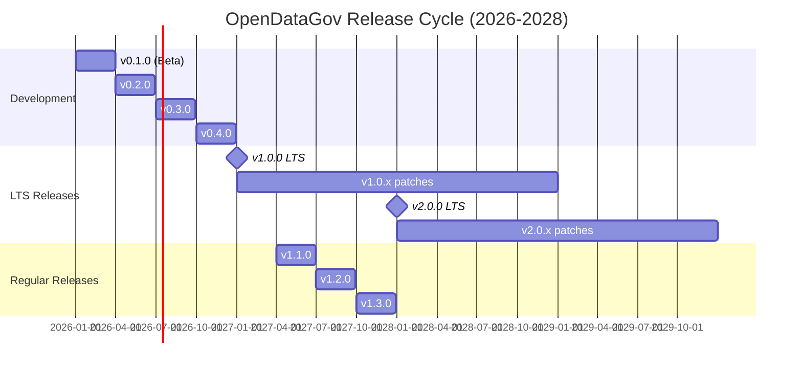

# ADR-095: LTS Release Cycle & Versioning Strategy

**Status:** Approved
**Date:** 2026-02-08
**Decision Makers:** Platform Team, DevOps Team, Product Team
**Stakeholders:** All Users, Enterprise Customers, Open Source Community

## Context

OpenDataGov é uma plataforma crítica de governança de dados usada por:

- **Enterprise Customers**: Produção 24/7, require stability e support estendido
- **Open Source Community**: Contribuidores precisam de clarity sobre versioning
- **Internal Teams**: Múltiplos serviços (30+) precisam de coordinated releases

### Problemas Atuais

1. **No Versioning Strategy**: Código em main sem tags/releases organizadas
1. **Breaking Changes**: Updates quebram clientes sem warning
1. **No LTS Support**: Customers não sabem qual version usar em produção
1. **Manual Releases**: Processo ad-hoc, propenso a erros
1. **No Upgrade Path**: Migração entre versions é manual e error-prone
1. **Dependency Hell**: Serviços com versões incompatíveis

### Requirements

**Functional:**

- Semantic versioning (MAJOR.MINOR.PATCH)
- LTS releases com suporte de 24 meses
- Regular releases a cada 3 meses
- Automated release pipeline (CI/CD)
- Backward compatibility guarantees
- Clear deprecation policy
- Database migration support

**Non-Functional:**

- Zero-downtime upgrades (rolling updates)
- Automated testing antes de releases
- Security patches para LTS versions dentro de 48h
- Release notes automáticos
- Helm chart versioning aligned com application
- Container image tagging strategy

## Decision

Implementar **LTS Release Cycle** baseado em Semantic Versioning com releases regulares e suporte estendido.

### Release Strategy



### Versioning Scheme

**Semantic Versioning (SemVer):**

```
MAJOR.MINOR.PATCH[-prerelease][+buildmetadata]

Examples:
- 0.1.0-beta.1       # Beta release
- 1.0.0              # First LTS release
- 1.0.1              # Patch release (bug fixes)
- 1.1.0              # Minor release (new features, backward compatible)
- 2.0.0              # Major release (breaking changes) - Next LTS
- 2.0.0-rc.1         # Release candidate
```

**Version Components:**

- **MAJOR**: Breaking changes (API incompatibility, schema changes)
- **MINOR**: New features, backward compatible
- **PATCH**: Bug fixes, security patches
- **Prerelease**: alpha, beta, rc (release candidate)

### Release Types

#### 1. LTS (Long-Term Support) Releases

**Frequency:** Once per year (January)
**Support Window:** 24 months
**Naming:** `X.0.0` (e.g., 1.0.0, 2.0.0, 3.0.0)

**Support Policy:**

- **Security Patches:** Critical and high severity within 48h
- **Bug Fixes:** Critical bugs within 1 week, high priority within 2 weeks
- **Backports:** Selected features backported on demand (paid support)
- **Documentation:** Maintained for entire support window

**LTS Schedule:**

| Version    | Release Date | EOL Date   | Support Duration |
| ---------- | ------------ | ---------- | ---------------- |
| v1.0.0 LTS | 2027-01-01   | 2029-01-01 | 24 months        |
| v2.0.0 LTS | 2028-01-01   | 2030-01-01 | 24 months        |
| v3.0.0 LTS | 2029-01-01   | 2031-01-01 | 24 months        |

#### 2. Regular Releases

**Frequency:** Every 3 months
**Support Window:** Until next release + 1 month
**Naming:** `X.Y.0` (e.g., 1.1.0, 1.2.0)

**Policy:**

- New features, improvements
- Backward compatible with same MAJOR version
- Security patches only (no bug fixes after EOL)

#### 3. Patch Releases

**Frequency:** As needed (typically weekly for LTS)
**Naming:** `X.Y.Z` (e.g., 1.0.1, 1.0.2)

**Contents:**

- Bug fixes only (no new features)
- Security patches
- Documentation updates
- Dependency updates (non-breaking)

#### 4. Prerelease Versions

**Types:**

- **Alpha** (`X.Y.0-alpha.N`): Internal testing, unstable
- **Beta** (`X.Y.0-beta.N`): Feature complete, community testing
- **RC** (`X.Y.0-rc.N`): Release candidate, final testing

**Policy:**

- No production use recommended
- No support provided
- Breaking changes allowed between prereleases

### Release Branches

**Git Branching Model (GitFlow):**

```
main (production-ready)
  ├─ release/v1.0.x (LTS branch)
  │   └─ hotfix/security-patch-cve-2026-12345
  ├─ release/v1.1.x (regular release)
  └─ develop (next release)
      ├─ feature/new-feature-x
      └─ feature/new-feature-y
```

**Branch Lifecycle:**

1. **develop**: Active development, unstable
1. **release/vX.Y.x**: Release branch (code freeze)
1. **main**: Tagged releases only (v1.0.0, v1.0.1, etc.)
1. **hotfix/**: Emergency fixes for production

### Compatibility Guarantees

**Backward Compatibility:**

- **API**: No breaking changes in MINOR/PATCH releases
- **Database Schema**: Forward-compatible migrations (MINOR releases)
- **Configuration**: Old configs work with new versions (within MAJOR)
- **Helm Charts**: Values.yaml backward compatible

**Breaking Changes Policy:**

1. Announce in release notes (MAJOR-1 release)
1. Deprecation warnings (logs, API responses)
1. Migration guide published
1. Grace period: 6 months before removal

**Example Deprecation:**

```python
# v1.5.0 - Deprecation warning
@deprecated(reason="Use new_api() instead", remove_in="2.0.0")
def old_api():
    warnings.warn("old_api() deprecated, use new_api()", DeprecationWarning)
    return new_api()

# v2.0.0 - Removed
# old_api() no longer exists
```

### Database Migration Strategy

**Forward-Compatible Migrations:**

```python
# v1.1.0 - Add new column (backward compatible)
def upgrade():
    op.add_column('users', sa.Column('new_field', sa.String(), nullable=True))

# v1.2.0 - Can still rollback to v1.1.0
def downgrade():
    op.drop_column('users', 'new_field')
```

**Breaking Migrations (MAJOR releases only):**

```python
# v2.0.0 - Breaking change
def upgrade():
    # Rename column (breaking)
    op.alter_column('users', 'old_name', new_column_name='new_name')

    # CANNOT rollback to v1.x after this migration
```

**Migration Testing:**

- Test upgrade path: v1.0 → v1.1 → v1.2 → v2.0
- Test rollback: v1.2 → v1.1 → v1.0
- Test skip upgrades: v1.0 → v2.0 (must be supported)

### Automated Release Pipeline

**GitHub Actions Workflow:**

```yaml
name: Release Pipeline

on:
  push:
    tags:
      - 'v*.*.*'

jobs:
  test:
    runs-on: ubuntu-latest
    steps:
      - name: Run tests
        run: pytest tests/

      - name: Integration tests
        run: pytest tests/integration/

      - name: E2E tests
        run: pytest tests/e2e/

  build:
    needs: test
    runs-on: ubuntu-latest
    steps:
      - name: Build Docker images
        run: docker build -t odg/service:${{ github.ref_name }} .

      - name: Build Helm chart
        run: helm package deploy/helm/opendatagov --version ${{ github.ref_name }}

  publish:
    needs: build
    runs-on: ubuntu-latest
    steps:
      - name: Push Docker images
        run: docker push odg/service:${{ github.ref_name }}

      - name: Publish Helm chart
        run: helm push opendatagov-${{ github.ref_name }}.tgz oci://registry.opendatagov.io

  release-notes:
    needs: publish
    runs-on: ubuntu-latest
    steps:
      - name: Generate release notes
        run: |
          npx semantic-release \
            --branches main \
            --plugins @semantic-release/changelog

      - name: Create GitHub Release
        uses: actions/create-release@v1
        with:
          tag_name: ${{ github.ref }}
          release_name: Release ${{ github.ref_name }}
          body_path: CHANGELOG.md
```

### Release Checklist

**Pre-Release (1 week before):**

- [ ] Code freeze (merge develop → release/vX.Y.x)
- [ ] Run full test suite (unit, integration, E2E)
- [ ] Update CHANGELOG.md with release notes
- [ ] Test database migrations (upgrade + rollback)
- [ ] Build and test Helm chart
- [ ] Security scan (Trivy, Snyk)
- [ ] Performance benchmarks (compare with previous version)
- [ ] Documentation review
- [ ] Create release candidate (vX.Y.0-rc.1)

**Release Day:**

- [ ] Final tests on RC
- [ ] Create Git tag (vX.Y.0)
- [ ] Build and push Docker images
- [ ] Publish Helm chart
- [ ] Generate release notes
- [ ] Create GitHub Release
- [ ] Update documentation website
- [ ] Announce on Slack, mailing list, blog
- [ ] Monitor deployment (canary rollout)

**Post-Release (1 week after):**

- [ ] Gather user feedback
- [ ] Monitor error rates, performance metrics
- [ ] Address critical issues (patch release if needed)
- [ ] Update compatibility matrix
- [ ] Retrospective meeting

### Upgrade Path

**Rolling Update (Zero-Downtime):**

```bash
# Kubernetes rolling update
kubectl set image deployment/governance-engine \
  governance-engine=odg/governance-engine:v1.1.0

# Helm upgrade
helm upgrade opendatagov oci://registry.opendatagov.io/opendatagov \
  --version 1.1.0 \
  --reuse-values \
  --wait
```

**Blue/Green Deployment:**

```bash
# Deploy new version (green)
helm install opendatagov-green oci://registry.opendatagov.io/opendatagov \
  --version 2.0.0 \
  --namespace opendatagov-green

# Test green environment
curl https://green.opendatagov.io/health

# Switch traffic (update Ingress)
kubectl patch ingress opendatagov \
  -p '{"spec":{"rules":[{"host":"opendatagov.io","http":{"paths":[{"backend":{"service":{"name":"opendatagov-green"}}}]}}]}}'

# Delete old version (blue)
helm uninstall opendatagov --namespace opendatagov
```

**Canary Deployment:**

```yaml
# 10% traffic to new version
apiVersion: flagger.app/v1beta1
kind: Canary
metadata:
  name: governance-engine
spec:
  targetRef:
    apiVersion: apps/v1
    kind: Deployment
    name: governance-engine
  service:
    port: 8000
  analysis:
    interval: 1m
    threshold: 5
    maxWeight: 50
    stepWeight: 10
    metrics:
      - name: request-success-rate
        thresholdRange:
          min: 99
        interval: 1m
```

### Container Image Tagging

**Tag Strategy:**

```bash
# Specific version (immutable)
docker pull odg/governance-engine:v1.0.0
docker pull odg/governance-engine:v1.0.1

# Latest patch in MINOR version (mutable)
docker pull odg/governance-engine:v1.0
docker pull odg/governance-engine:v1.1

# Latest in MAJOR version (mutable)
docker pull odg/governance-engine:v1

# Latest LTS (mutable)
docker pull odg/governance-engine:lts

# Latest (mutable, not recommended for production)
docker pull odg/governance-engine:latest
```

**Recommendation:**

- **Production**: Pin to specific version (v1.0.0)
- **Staging**: Use MINOR version (v1.0) for auto-updates
- **Development**: Use latest

### Helm Chart Versioning

**Chart.yaml:**

```yaml
apiVersion: v2
name: opendatagov
version: 1.0.0         # Chart version (SemVer)
appVersion: 1.0.0      # Application version

dependencies:
  - name: postgresql
    version: 12.1.9     # Pin dependencies
    repository: https://charts.bitnami.com/bitnami
```

**Versioning:**

- Chart version follows app version
- Breaking changes in values.yaml → MAJOR bump
- New chart features → MINOR bump
- Bug fixes → PATCH bump

## Implementation Plan

### Phase 1: Versioning Infrastructure (Weeks 1-2)

**Setup:**

- [ ] Configure semantic-release
- [ ] Create release branches (develop, main)
- [ ] Setup Git tags protection
- [ ] Document branching strategy

**Automation:**

- [ ] GitHub Actions for release pipeline
- [ ] Automated changelog generation
- [ ] Docker image tagging automation
- [ ] Helm chart versioning automation

### Phase 2: Migration Tooling (Weeks 3-4)

**Database Migrations:**

- [ ] Alembic setup for all services
- [ ] Forward-compatible migration templates
- [ ] Migration testing framework
- [ ] Rollback procedures documented

**Upgrade Scripts:**

- [ ] Pre-upgrade checks (compatibility)
- [ ] Post-upgrade validation
- [ ] Rollback scripts
- [ ] Smoke tests

### Phase 3: First Release (v1.0.0 LTS) (Weeks 5-8)

**Preparation:**

- [ ] Stabilize develop branch (code freeze)
- [ ] Full test suite (unit, integration, E2E)
- [ ] Performance benchmarks baseline
- [ ] Security audit (Trivy, Snyk)
- [ ] Documentation freeze

**Release:**

- [ ] Create v1.0.0-rc.1 (release candidate)
- [ ] Community testing (2 weeks)
- [ ] Fix critical issues
- [ ] Create v1.0.0 final
- [ ] Publish Docker images, Helm charts
- [ ] Announce release

### Phase 4: Support Infrastructure (Weeks 9-10)

**Backport Process:**

- [ ] Backport criteria documented
- [ ] Automated backport tooling
- [ ] Testing for LTS branches

**Monitoring:**

- [ ] Release adoption metrics (Prometheus)
- [ ] Upgrade success/failure tracking
- [ ] Version compatibility dashboard

### Phase 5: Documentation (Weeks 11-12)

**User Docs:**

- [ ] Upgrade guide (X.Y → X.Z)
- [ ] Migration guide (MAJOR upgrades)
- [ ] Deprecation notices
- [ ] Compatibility matrix

**Internal Docs:**

- [ ] Release runbook
- [ ] Incident response for releases
- [ ] Rollback procedures
- [ ] Post-mortem template

**Total Timeline:** 12 weeks (~3 months)

## Consequences

### Positive

✅ **Stability**: LTS releases com 24 meses support
✅ **Predictability**: Release calendar conhecido com antecedência
✅ **Automation**: Releases automáticos via CI/CD
✅ **Trust**: Semantic versioning clarifica breaking changes
✅ **Rollback**: Clear downgrade path se problemas
✅ **Testing**: Automated testing antes de cada release
✅ **Documentation**: Release notes e changelogs automáticos

### Negative

⚠️ **Overhead**: Manter múltiplas release branches
⚠️ **Backports**: Esforço para backport fixes para LTS
⚠️ **Testing**: Testar upgrade paths consome tempo
⚠️ **Coordination**: 30+ serviços precisam de coordinated releases

### Risks & Mitigations

| Risk                              | Impact | Likelihood | Mitigation                                        |
| --------------------------------- | ------ | ---------- | ------------------------------------------------- |
| Breaking changes in MINOR release | High   | Medium     | Automated compatibility tests, semver enforcement |
| Failed database migration         | High   | Low        | Test migrations in staging, rollback scripts      |
| LTS backport conflicts            | Medium | Medium     | Cherry-pick tool, automated conflict detection    |
| Release automation failure        | Medium | Low        | Manual release runbook, dry-run tests             |
| Version skew (microservices)      | High   | Medium     | Compatibility matrix, health checks               |

## Alternatives Considered

### 1. Calendar Versioning (CalVer)

**Example:** `2026.01.0`, `2026.04.0`

**Pros:** Clear when released
**Cons:** Não indica breaking changes, confuso para libraries
**Verdict:** ❌ Rejected (SemVer melhor para libraries/APIs)

### 2. Continuous Deployment (No Versions)

**Pros:** Deploy imediato, sem overhead de releases
**Cons:** Sem rollback guarantees, enterprises require versions
**Verdict:** ❌ Rejected (enterprises precisam de stability)

### 3. LTS Every 6 Months

**Pros:** Mais opções LTS para users
**Cons:** Overhead de manter muitas LTS branches
**Verdict:** ⚠️ Rejected (12 meses é sweet spot)

## Success Metrics

**Adoption:**

- [ ] 80% of production users on LTS within 6 months
- [ ] 50% of users upgrade within 1 month of release
- [ ] 5+ community contributors per release

**Quality:**

- [ ] Zero critical bugs in LTS releases (first 30 days)
- [ ] 99.9% upgrade success rate
- [ ] < 5% rollback rate

**Process:**

- [ ] 100% automated releases (no manual steps)
- [ ] Release notes generated automatically
- [ ] < 4h from tag to published release

## References

- [Semantic Versioning 2.0.0](https://semver.org/)
- [GitFlow Branching Model](https://nvie.com/posts/a-successful-git-branching-model/)
- [Kubernetes Release Versioning](https://kubernetes.io/releases/)
- [Node.js LTS Schedule](https://nodejs.org/en/about/releases/)
- [Ubuntu LTS Releases](https://ubuntu.com/about/release-cycle)
