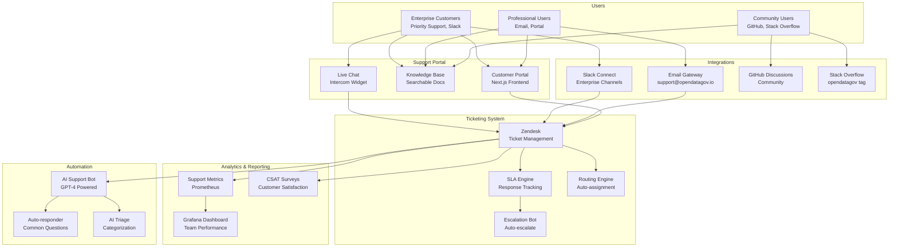

# ADR-096: Enterprise/Public Support Portal

**Status:** Approved
**Date:** 2026-02-08
**Decision Makers:** Customer Success Team, Engineering Team, Product Team
**Stakeholders:** Enterprise Customers, Community Users, Support Team

## Context

OpenDataGov é usado por múltiplos tipos de usuários com diferentes necessidades de suporte:

- **Open Source Community**: Self-service, documentation, forums
- **Professional Users**: Email support, reasonable SLAs
- **Enterprise Customers**: Priority support, dedicated channels, guaranteed SLAs

### Problemas Atuais

1. **No Structured Support**: GitHub Issues usado para tudo (bugs, questions, support)
1. **No SLA Tracking**: Sem garantias de response time
1. **No Knowledge Base**: Documentação espalhada, difícil de encontrar
1. **No Customer Portal**: Enterprise customers não têm acesso prioritário
1. **No Support Metrics**: Sem tracking de satisfaction, resolution time
1. **Email Overload**: support@opendatagov.io sem estrutura (tickets perdidos)

### Requirements

**Functional:**

- Multi-tier support (Community, Professional, Enterprise)
- Ticketing system com SLA tracking
- Knowledge base searchable e self-service
- Customer portal para enterprise
- Live chat para quick questions
- Email-to-ticket conversion
- Support analytics dashboard

**Non-Functional:**

- Community: Best effort (no SLA)
- Professional: 48h first response SLA
- Enterprise: 4h critical, 8h high, 24h normal SLA
- Knowledge base uptime: 99.9%
- Portal response time: < 2s (p95)
- Support satisfaction (CSAT): > 90%

## Decision

Implementar **Enterprise/Public Support Portal** com suporte multi-tier, knowledge base, e analytics.

### Architecture Overview



### Support Tiers

#### 1. Community Support (Free)

**Channels:**

- GitHub Discussions (https://github.com/opendatagov/opendatagov/discussions)
- Stack Overflow (`opendatagov` tag)
- Public documentation (https://docs.opendatagov.io)
- Community Slack (read-only for non-contributors)

**SLA:**

- No guaranteed response time
- Best effort from community + core team
- Expected: 24-72h for common questions

**Features:**

- ✅ Access to knowledge base
- ✅ Public bug reports
- ✅ Feature requests
- ✅ Community forum
- ❌ No private support
- ❌ No priority handling
- ❌ No guaranteed SLA

**Example Use Cases:**

- "How do I configure DataHub integration?"
- "What's the recommended way to setup Kafka?"
- "Is there a Python SDK for OpenDataGov?"

#### 2. Professional Support ($499/month per organization)

**Channels:**

- Email: professional@opendatagov.io
- Customer Portal: https://support.opendatagov.io
- Knowledge Base (full access)

**SLA:**

- **First Response:** 48h business hours
- **Resolution Target:** 10 business days
- **Availability:** Mon-Fri, 9am-5pm EST
- **Support Hours:** 40h/month included

**Features:**

- ✅ Email support
- ✅ Ticket tracking
- ✅ Knowledge base access
- ✅ Monthly support reports
- ✅ Named support contact
- ❌ No phone support
- ❌ No 24/7 coverage
- ❌ No dedicated Slack channel

**Ticket Priorities:**

| Priority | First Response | Resolution Target |
| -------- | -------------- | ----------------- |
| Normal   | 48h            | 10 business days  |
| High     | 24h            | 5 business days   |
| Urgent   | 8h             | 2 business days   |

**Example Use Cases:**

- "Our deployment is failing with error X"
- "How do we migrate from v1.0 to v1.1?"
- "Can you review our Helm chart configuration?"

#### 3. Enterprise Support ($2,999/month per organization)

**Channels:**

- Email: enterprise@opendatagov.io (priority queue)
- Customer Portal: https://support.opendatagov.io (priority)
- Dedicated Slack Connect channel
- Phone support (callback only, for critical issues)
- Quarterly business reviews (QBR)

**SLA:**

- **Critical (P1):** 4h response, 24h resolution target
- **High (P2):** 8h response, 3 business days resolution
- **Normal (P3):** 24h response, 7 business days resolution
- **Low (P4):** 48h response, 14 business days resolution
- **Availability:** 24/7 for P1, business hours for P2-P4
- **Support Hours:** Unlimited

**Features:**

- ✅ 24/7 critical support
- ✅ Dedicated Slack channel
- ✅ Phone support (callback)
- ✅ Named Customer Success Manager
- ✅ Quarterly Business Reviews
- ✅ Architecture reviews
- ✅ Performance tuning assistance
- ✅ Early access to new features
- ✅ Priority bug fixes
- ✅ Custom training sessions
- ✅ On-premise deployment support

**Ticket Priorities:**

| Priority          | Definition                              | First Response | Resolution Target | Escalation                       |
| ----------------- | --------------------------------------- | -------------- | ----------------- | -------------------------------- |
| **P1 - Critical** | Production down, data loss              | 4h (24/7)      | 24h               | Auto-escalate to VP Eng after 2h |
| **P2 - High**     | Major feature broken, workaround exists | 8h             | 3 business days   | Escalate after 4h                |
| **P3 - Normal**   | Minor feature broken, question          | 24h            | 7 business days   | Escalate after 24h               |
| **P4 - Low**      | Enhancement request, documentation      | 48h            | 14 business days  | No auto-escalation               |

**Example Use Cases:**

- "Production is down, Kafka consumer is crashing" (P1)
- "Data quality checks failing after upgrade" (P2)
- "Help us design data lineage for 500 datasets" (P3)
- "Request documentation for custom plugin development" (P4)

### Customer Portal

**URL:** https://support.opendatagov.io

**Features:**

1. **Ticket Management**

   - Create new tickets
   - View ticket history
   - Upload attachments (logs, screenshots)
   - Real-time status updates
   - Comment on existing tickets

1. **Knowledge Base Search**

   - Full-text search
   - Categorized articles
   - Video tutorials
   - Code examples
   - API reference

1. **Account Management**

   - View support tier
   - Track SLA compliance
   - Download invoices
   - Manage team members

1. **Analytics**

   - Ticket trends
   - Resolution time charts
   - CSAT scores
   - Support usage (hours consumed)

**Tech Stack:**

- **Frontend:** Next.js 14 (App Router)
- **Backend:** FastAPI (Python)
- **Database:** PostgreSQL
- **Auth:** Auth0 (SSO support for enterprise)
- **Search:** Elasticsearch
- **CDN:** Cloudflare

### Ticketing System Integration

**Platform:** Zendesk (chosen for enterprise features)

**Alternative Considered:**

- Freshdesk: Good for SMB, limited enterprise features
- Jira Service Management: Complex, overkill
- Custom Solution: Too much engineering overhead

**Zendesk Setup:**

```yaml
# Zendesk Configuration
organization: opendatagov
subdomain: opendatagov.zendesk.com

# Ticket Fields
custom_fields:
  - name: Support Tier
    type: dropdown
    values: [Community, Professional, Enterprise]

  - name: Product Area
    type: dropdown
    values:
      - Data Catalog
      - Governance Engine
      - GPU Cluster
      - Federation
      - MLOps
      - Quality Checks
      - Lineage
      - Other

  - name: Environment
    type: dropdown
    values: [Production, Staging, Development, Other]

  - name: OpenDataGov Version
    type: text
    required: true

# SLA Policies
sla_policies:
  - name: Enterprise Critical (P1)
    target: 4h
    business_hours: false  # 24/7

  - name: Enterprise High (P2)
    target: 8h
    business_hours: true

  - name: Professional Normal
    target: 48h
    business_hours: true

# Automations
automations:
  - name: Auto-tag with product area
    trigger: Ticket created
    action: AI categorization (GPT-4)

  - name: SLA breach warning
    trigger: 80% of SLA elapsed
    action: Notify manager, escalate

  - name: CSAT survey
    trigger: Ticket solved
    action: Send satisfaction survey (24h delay)
```

### Knowledge Base

**Platform:** Confluence Cloud or custom (Next.js + Markdown)

**Structure:**

```
Knowledge Base
├── Getting Started
│   ├── Installation
│   ├── Quick Start Guide
│   └── First Steps
│
├── Platform Features
│   ├── Data Catalog
│   ├── Governance Engine
│   ├── Quality Checks
│   ├── Lineage Tracking
│   ├── GPU Cluster Management
│   └── Federation (COSMOS)
│
├── Deployment
│   ├── Kubernetes Deployment
│   ├── Helm Configuration
│   ├── Cloud Providers (AWS, GCP, Azure)
│   └── On-Premise Setup
│
├── Integration Guides
│   ├── DataHub Integration
│   ├── Kafka Setup
│   ├── MLflow Integration
│   ├── Kubeflow Integration
│   └── Custom Integrations
│
├── API Reference
│   ├── REST API v1
│   ├── GraphQL API
│   ├── Python SDK
│   └── Authentication
│
├── Troubleshooting
│   ├── Common Issues
│   ├── Error Messages
│   ├── Performance Tuning
│   └── Debug Logging
│
├── Best Practices
│   ├── Security Hardening
│   ├── High Availability
│   ├── Backup & Recovery
│   └── Monitoring & Alerting
│
└── Release Notes
    ├── v1.0.0 LTS
    ├── v0.4.0
    └── Upgrade Guides
```

**Search Features:**

- Full-text search (Elasticsearch)
- Autocomplete suggestions
- "Did you mean...?" corrections
- Related articles
- Most popular articles (trending)

### Live Chat Integration

**Platform:** Intercom

**Configuration:**

```javascript
// Intercom widget on support portal
window.Intercom('boot', {
  app_id: 'opendatagov',
  user_id: user.id,
  name: user.name,
  email: user.email,
  company: {
    id: user.organization_id,
    name: user.organization_name,
    plan: user.support_tier  // Community, Professional, Enterprise
  },
  custom_launcher_selector: '#support-chat-button'
});
```

**Rules:**

- **Community:** Chatbot only (no human handoff)
- **Professional:** Chatbot + human handoff (business hours)
- **Enterprise:** Chatbot + immediate human handoff (24/7)

**Chatbot (GPT-4 Powered):**

```python
# AI Support Bot
class SupportBot:
    def __init__(self):
        self.llm = OpenAI(model="gpt-4-turbo")
        self.knowledge_base = load_knowledge_base()

    def answer_question(self, question: str, context: dict) -> str:
        """Answer support question using RAG."""
        # Retrieve relevant docs
        relevant_docs = self.knowledge_base.search(question, top_k=5)

        # Generate answer
        prompt = f"""
        You are an OpenDataGov support assistant.

        User question: {question}

        Relevant documentation:
        {relevant_docs}

        User context:
        - Support tier: {context['tier']}
        - Version: {context['version']}
        - Environment: {context['environment']}

        Provide a helpful, accurate answer. If you're not confident,
        suggest creating a support ticket.
        """

        response = self.llm.complete(prompt)
        return response
```

### SLA Management

**SLA Engine:**

```python
from datetime import datetime, timedelta

class SLAEngine:
    """Track and enforce SLA compliance."""

    SLA_TARGETS = {
        ("Enterprise", "P1"): timedelta(hours=4),
        ("Enterprise", "P2"): timedelta(hours=8),
        ("Enterprise", "P3"): timedelta(hours=24),
        ("Enterprise", "P4"): timedelta(hours=48),
        ("Professional", "Normal"): timedelta(hours=48),
        ("Professional", "High"): timedelta(hours=24),
        ("Professional", "Urgent"): timedelta(hours=8),
    }

    ESCALATION_RULES = {
        ("Enterprise", "P1"): {
            "80%": "notify_manager",
            "100%": "escalate_to_vp_engineering",
            "120%": "page_on_call"
        },
        ("Enterprise", "P2"): {
            "80%": "notify_manager",
            "100%": "escalate_to_director"
        }
    }

    def calculate_sla_breach_time(
        self,
        tier: str,
        priority: str,
        created_at: datetime
    ) -> datetime:
        """Calculate when SLA will be breached."""
        target = self.SLA_TARGETS.get((tier, priority))
        if not target:
            return None

        # Account for business hours
        if tier == "Professional":
            breach_time = self.add_business_hours(created_at, target)
        else:  # Enterprise P1 is 24/7
            breach_time = created_at + target

        return breach_time

    def check_escalation(
        self,
        tier: str,
        priority: str,
        created_at: datetime
    ) -> list[str]:
        """Check if escalation is needed."""
        target = self.SLA_TARGETS.get((tier, priority))
        if not target:
            return []

        elapsed = datetime.utcnow() - created_at
        percentage = (elapsed / target) * 100

        actions = []
        escalation_rules = self.ESCALATION_RULES.get((tier, priority), {})

        for threshold, action in escalation_rules.items():
            threshold_pct = int(threshold.rstrip('%'))
            if percentage >= threshold_pct:
                actions.append(action)

        return actions
```

**SLA Monitoring (Prometheus Metrics):**

```python
# Prometheus metrics
from prometheus_client import Gauge, Histogram

sla_compliance_rate = Gauge(
    'support_sla_compliance_rate',
    'Percentage of tickets meeting SLA',
    ['tier', 'priority']
)

first_response_time = Histogram(
    'support_first_response_time_seconds',
    'Time to first response',
    ['tier', 'priority'],
    buckets=[300, 900, 1800, 3600, 14400, 28800, 86400, 172800]  # 5m, 15m, 30m, 1h, 4h, 8h, 24h, 48h
)

resolution_time = Histogram(
    'support_resolution_time_seconds',
    'Time to resolution',
    ['tier', 'priority']
)

csat_score = Gauge(
    'support_csat_score',
    'Customer satisfaction score (1-5)',
    ['tier']
)
```

### Support Analytics Dashboard

**Grafana Dashboard:**

```yaml
# Support Team Performance Dashboard
dashboard:
  title: OpenDataGov Support Metrics
  refresh: 5m
  time_range: 7d

  panels:
    - title: SLA Compliance Rate (Last 30 Days)
      type: gauge
      query: |
        100 * (
          sum(support_tickets_within_sla) /
          sum(support_tickets_total)
        )
      targets:
        - target: 95%  # Red if below
        - warning: 98%  # Yellow if below
        - good: 99%     # Green if above

    - title: Tickets by Tier
      type: pie_chart
      query: |
        sum(support_tickets_created) by (tier)

    - title: Average First Response Time
      type: time_series
      queries:
        - Enterprise P1: avg(support_first_response_time{tier="Enterprise",priority="P1"})
        - Enterprise P2: avg(support_first_response_time{tier="Enterprise",priority="P2"})
        - Professional: avg(support_first_response_time{tier="Professional"})

    - title: CSAT Score Trend
      type: time_series
      query: |
        avg(support_csat_score) by (tier)

    - title: Open Tickets by Age
      type: bar_chart
      queries:
        - 0-24h: count(support_tickets{status="open",age_hours<24})
        - 24-72h: count(support_tickets{status="open",age_hours>=24,age_hours<72})
        - >72h: count(support_tickets{status="open",age_hours>=72})

    - title: Top Product Areas
      type: table
      query: |
        topk(10, sum(support_tickets_created) by (product_area))

    - title: Agent Performance
      type: table
      columns:
        - Agent Name
        - Tickets Resolved
        - Avg Resolution Time
        - CSAT Score
      query: |
        sum(support_tickets_resolved) by (agent_name)
```

## Implementation Plan

### Phase 1: Foundation (Weeks 1-2)

**Setup:**

- [ ] Zendesk account setup
- [ ] Configure support tiers (Community, Professional, Enterprise)
- [ ] Setup email forwarding (support@opendatagov.io → Zendesk)
- [ ] Create SLA policies in Zendesk
- [ ] Setup basic automations (auto-tag, SLA warnings)

**Documentation:**

- [ ] Document support tier benefits
- [ ] Create ticket submission guidelines
- [ ] Write internal support runbook

### Phase 2: Customer Portal (Weeks 3-4)

**Frontend:**

- [ ] Next.js 14 app with App Router
- [ ] Authentication (Auth0 integration)
- [ ] Ticket creation form
- [ ] Ticket history view
- [ ] Knowledge base search

**Backend:**

- [ ] FastAPI service
- [ ] Zendesk API integration
- [ ] PostgreSQL database (user accounts, metadata)
- [ ] Elasticsearch setup (knowledge base search)

### Phase 3: Knowledge Base (Weeks 5-6)

**Content:**

- [ ] Migrate existing docs to knowledge base
- [ ] Write troubleshooting guides
- [ ] Create video tutorials (Getting Started, Common Issues)
- [ ] API reference documentation
- [ ] Setup search (Elasticsearch)

**Features:**

- [ ] Full-text search
- [ ] Related articles
- [ ] Popular articles widget
- [ ] Feedback buttons ("Was this helpful?")

### Phase 4: Live Chat (Week 7)

**Intercom Setup:**

- [ ] Intercom account setup
- [ ] Widget integration on portal
- [ ] Business hours configuration
- [ ] Routing rules (chatbot vs. human)

**AI Chatbot:**

- [ ] GPT-4 integration
- [ ] RAG with knowledge base
- [ ] Common questions database
- [ ] Handoff to human logic

### Phase 5: Analytics & Monitoring (Weeks 8-9)

**Metrics:**

- [ ] Prometheus exporters (Zendesk API)
- [ ] Grafana dashboard
- [ ] SLA compliance tracking
- [ ] CSAT survey automation
- [ ] Weekly/monthly reports

**Alerts:**

- [ ] SLA breach warnings (Slack, PagerDuty)
- [ ] Ticket backlog alerts (>50 open)
- [ ] Low CSAT alerts (\<4.0)

### Phase 6: Enterprise Features (Week 10)

**Slack Connect:**

- [ ] Setup Slack Connect channels for enterprise customers
- [ ] Zendesk ↔ Slack integration
- [ ] Auto-create ticket from Slack thread

**QBR Process:**

- [ ] Quarterly Business Review template
- [ ] Automated report generation
- [ ] Metrics deck (tickets, SLA, CSAT, roadmap)

### Phase 7: Testing & Launch (Weeks 11-12)

**Testing:**

- [ ] Beta test with 3 enterprise customers
- [ ] Load test portal (1000 concurrent users)
- [ ] Test SLA escalations
- [ ] Validate CSAT survey flow

**Launch:**

- [ ] Announce new support portal
- [ ] Migrate existing tickets to Zendesk
- [ ] Train support team
- [ ] Update website with support tier info

**Total Timeline:** 12 weeks (~3 months)

## Consequences

### Positive

✅ **Structured Support**: Clear tiers, SLAs, escalation paths
✅ **Enterprise Ready**: 24/7 support, dedicated channels, QBRs
✅ **Self-Service**: Knowledge base reduces ticket volume
✅ **Visibility**: Metrics, dashboards, CSAT tracking
✅ **Scalability**: Zendesk handles 10k+ tickets/month
✅ **Revenue**: Professional ($499/mo), Enterprise ($2,999/mo)

### Negative

⚠️ **Cost**: Zendesk Enterprise ($215/agent/month × 5 agents = $1,075/month)
⚠️ **Overhead**: Support team needs training on Zendesk
⚠️ **Complexity**: Multiple channels to monitor (email, Slack, chat, portal)
⚠️ **Community Perception**: "Paid support" may discourage community contributions

### Risks & Mitigations

| Risk                        | Impact | Likelihood | Mitigation                                              |
| --------------------------- | ------ | ---------- | ------------------------------------------------------- |
| SLA breach (Enterprise P1)  | High   | Medium     | Auto-escalation, on-call rotation, 24/7 coverage        |
| Zendesk outage              | Medium | Low        | Fallback to email, status page, offline ticket queue    |
| Support team overload       | High   | Medium     | Hire 2 additional support engineers, chatbot deflection |
| Low knowledge base adoption | Medium | Medium     | Promote in-app, SEO optimization, video tutorials       |
| Poor CSAT scores            | High   | Low        | Regular training, quality reviews, escalation for \<3.0 |

## Alternatives Considered

### 1. GitHub Issues Only

**Pros:** Simple, no cost, already used
**Cons:** No SLA, no tiers, no analytics, unprofessional for enterprise
**Verdict:** ❌ Rejected (not enterprise-ready)

### 2. Custom Ticketing System

**Pros:** Full control, no licensing costs
**Cons:** Months of engineering, maintenance burden
**Verdict:** ❌ Rejected (not core competency)

### 3. Freshdesk

**Pros:** Cheaper than Zendesk ($69/agent/month)
**Cons:** Limited enterprise features, weaker API
**Verdict:** ⚠️ Considered but Zendesk chosen for enterprise features

## Success Metrics

**SLA Compliance:**

- [ ] 99% of Enterprise P1 tickets resolved within SLA
- [ ] 95% of Professional tickets resolved within SLA
- [ ] 90% of all tickets resolved within target

**Customer Satisfaction:**

- [ ] CSAT score > 4.5/5.0 (90%)
- [ ] < 5% negative feedback
- [ ] 80% survey response rate

**Efficiency:**

- [ ] 60% ticket deflection via knowledge base
- [ ] Average first response time < SLA target
- [ ] 70% tickets resolved on first contact

**Revenue:**

- [ ] 10 Professional customers ($4,990/month) in 6 months
- [ ] 5 Enterprise customers ($14,995/month) in 12 months
- [ ] Total ARR: $239,820/year

## References

- [Zendesk Best Practices](https://www.zendesk.com/service/help-center/best-practices/)
- [SLA Management Guide](https://www.atlassian.com/incident-management/kpis/sla-vs-slo-vs-sli)
- [Customer Support Metrics](https://www.helpscout.com/helpu/customer-service-metrics/)
- [Intercom Chatbot Setup](https://www.intercom.com/help/en/articles/324-get-started-with-the-intercom-messenger)
